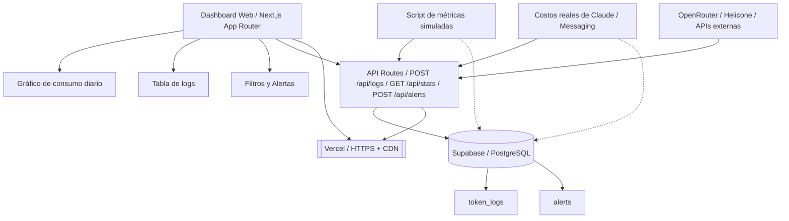

# 🧪 Lab 1 — Dashboard de Monitoreo de Tokens (Web + API)

## 📋 Descripción del Lab

**Equipo**: Next.js 15 + Supabase + Tailwind CSS + Recharts
**Duración**: 4-6 horas (≈10,000 tokens)
**Skill objetivo**: Construir CI, CI/CD, CaaS, IaC, GitOps en miniatura

### 🎯 Objetivo del Lab

Construir **una plataforma web completa e inteligente** que:

1. **Reciba** logs de consumo de tokens (API REST)
2. **Almacene** cada llamada: modelo, tokens input/output, costo, proyecto, timestamp
3. **Muestre un dashboard** con gráficos de consumo por día/proyecto/modelo
4. **Calcule costos** estimados automáticamente
5. **Envíe alertas** cuando un umbral configurable se supere
6. **Exponga una API REST** reutilizable para futuros proyectos

---

## 🏗️ Arquitectura (Mermaid)



---

## 📁 Estructura del proyecto

```
lab-1-dashboard-tokens/
├── app/
│   ├── page.tsx              # Dashboard principal
│   ├── logs/page.tsx         # Gestión de logs
│   ├── stats/route.ts        # API routes
│   └── alerts/route.ts       # API alerts
├── lib/
│   ├── database.ts           # Cliente Supabase
│   └── metrics.ts            # Helper functions
├── components/
│   ├── TokenChart.tsx        # Componente gráfico
│   ├── MetricsTable.tsx      # Componente tabla
│   └── AlertBanner.tsx       # Alertas
├── hooks/
│   └── useMetrics.ts        # Custom hooks
├── styles/
│   └── globals.css           # Tailwind global styles
├── supabase/
│   └── schema.sql           # DDL (token_logs, alerts)
├── scripts/
│   ├── seed-logs.ts          # Datos de prueba
│   └── send-metrics.ts       # Script de métricas simuladas
├── public/
│   └── robots.txt           # SEO
├── vercel.json               # Configuración para despliegue
└── README.md                 # Guide para el estudiante
```

---

## 🛠️ Consideraciones técnicas

### Stack elegido

| Componente | Versión | Por qué |
|-------------|--------|--------|
| **Next.js** | 15 (App Router) | Edge functions serverless, SWR para cache, optimización automática de imágenes |
| **Supabase** | PostgreSQL + Extensions | Postgres + Auth + CDN + Serverless | Función `%RLS%` incorporada |
| **Tailwind CSS** | 3.x | Utilidades-first, SSR, theme-switching optimizado |
| **Recharts** | v2.x | Gráficos dark/light mode, responsivos, accesible |
| **Vercel** | Best-in-class | CI/CD constante, preview URLs, HTTPS gratis + CDN, monitoreo de solicitudes |

### Decisiones de diseño

#### ¿Por qué App Router vs Pages Router?

- **Optimización SEO**: Los Server Components capturan más métricas (pueden ser cacheados, renderizados estáticos).
- **Split-by-import**: Colocar cada API route en un `*.ts` aparte (estilo middleware).
- **SWR / TanStack Query**: Para cargas diferidas → más rápidas y optimizadas en caché para analytics.

#### ¿Por qué Supabase vs Atlas/Railway/DigitalOcean? 

- **Completo**: Bases de datos, Auth, Almacenamiento, Captcha, etc.
- **Free tier**: 500 MB de almacenamiento, 2 GB de ancho de banda → suficiente para prototipado.
- **RLS**: Nivel de empresa, multi-proyecto, leyes GDPR.

#### ¿Por qué Recharts vs D3/Five-hundred? 

- **API simple**: "Datos API directa", sin props adicionales.
- **Interfaz de usuario sensible** al dark/light mode.
- **Accesible** y tamaño de bundle).

---

## ⛽ SDK setup (comando) 

```bash
# Instalaciones (haces 1 vez)
npx create-next-app@latest lab-1-dashboard-tokens \
  --typescript \
  --tailwind \
  --eslint \
  --src-dir \
  --app

cd lab-1-dashboard-tokens

# Base de datos (una vez)
npx supabase init --with-schema supabase/schema.sql

# Dependencias del proyecto
npm install @supabase/ssr recharts date-fns
a npm add -D @types/node

# Spread sheet (nuestra "Capa de datos")
# (Copias las tablas token_logs y alerts más abajo)
```

---

## 🗃️ Schema SQL (supabase/schema.sql)

```sql
-- token_logs: cada llamada a IA registrada
create table if not exists token_logs (
  id bigserial primary key,
  project text not null,                     -- {{NOMBRE DEL PROYECTO}}
  model text not null,                      -- "claude-sonnet-4", "gpt-4o-mini", etc.
  input_tokens integer not null,             -- tokens que enviamos
  output_tokens integer not null,            -- tokens que recibimos
  cached_tokens integer not null default 0,  -- tokens cacheados
  cost numeric(10,4) not null,              -- en USD
  endpoint text not null,                   -- "/api/chat", "/api/analyze", etc.
  timestamp timestamptz not null default now()
);

-- RLS habilitado: solo el propietario del proyecto puede ver/Escribir
create policy token_logs_policy on token_logs
  for all to anon using (project = current_setting('app.current_project'));
create policy token_logs_policy on token_logs
  for all to anon with check (project = current_setting('app.current_project'));

-- alerts: umbrales configurados por el usuario
create table if not exists alerts (
  id bigserial primary key,
  project text not null,
  metric text not null,                     -- "cost_daily", "token_ratio", etc.
  threshold numeric not null,                -- límite de alerta
  enabled boolean not null default true,     -- on/off
  webhook_url text,                         -- opcional para notificaciones
  created_at timestamptz not null default now()
);

-- RLS similar del lado de los alerts
create policy alerts_policy on alerts
  for all to anon using (project = current_setting('app.current_project'));
```

---

## 📝 Configuración del cliente de Supabase (lib/database.ts)

```typescript
// lib/database.ts
import { createBrowserClient } from '@supabase/ssr'

export const createSupabaseBrowserClient = () =>
  createBrowserClient(
    process.env.NEXT_PUBLIC_SUPABASE_URL!,
    process.env.NEXT_PUBLIC_SUPABASE_ANON_KEY!
  )

// UX DisplayName para depuración dentro del componente
export const supabase = createSupabaseBrowserClient()
```

---

## 🔌 Hooks de API (lib/metrics.ts) 

```typescript
// lib/metrics.ts
import { supabase } from './database'

type TokenLog = {
  project: string
  model: string
  input_tokens: number
  output_tokens: number
  cached_tokens: number
  cost: number
  endpoint: string
  timestamp?: string
}

type Alert = {
  id: string
  project: string
  metric: string
  threshold: number
  enabled: boolean
}

// Write a single log entry
export async function logTokenMetrics(metrics: TokenLog) {
  const { data, error } = await supabase
    .from('token_logs')
    .insert([metrics])

  if (error) throw error
  return data
}

// Stream logs en tiempo real (usando suscripción)
export function subscribeToLogs(project: string, cb: (log: TokenLog) => void) {
  return supabase
    .from('token_logs')
    .select('*')
    .eq('project', project)
    .order('timestamp', { ascending: false })
    .limit(50)
    .then(({ data, error, channel }) => {
      if (error) throw error
      // SWR-like logic
      channel?.on('postgres_changes', ...)
      return () => channel?.unsubscribe()
    })
}

// Fetch aggregations (daily, by model, etc.)
export async function getMetricsStats(project: string, range: 'hour' | 'day' | 'week') {
  const start = new Date()
  if (range === 'hour') start.setHours(start.getHours() - 1)
  else if (range === 'day') start.setDate(start.getDate() - 1)
  else start.setDate(start.getDate() - 7)

  const { data, error } = await supabase
    .from('token_logs')
    .select('model, input_tokens, output_tokens, cost')
    .eq('project', project)
    .gte('timestamp', start.toISOString())

  if (error) throw error

  const aggregated = data.reduce((acc, row) => {
    acc.total_input += row.input_tokens
    acc.total_output += row.output_tokens
    acc.total_cost += row.cost
    acc.models[row.model] = (acc.models[row.model] || 0) + 1
    return acc
  }, { total_input: 0, total_output: 0, total_cost: 0, models: {} })

  return {
    total_input: aggregated.total_input,
    total_output: aggregated.total_output,
    total_cost: aggregated.total_cost,
    avg_tokens_per_call: (aggregated.total_input + aggregated.total_output) / (data.length || 1),
    models: aggregated.models
  }
}

// Gestionar alertas
define interface AlertRow {
  id: string
  project: string
  metric: string
  threshold: number
  enabled: boolean
  webhook_url?: string
}

export async function updateAlert(alert: AlertRow) {
  const { data, error } = await supabase
    .from('alerts')
    .upsert([alert])
    .select()

  if (error) throw error
  return data
}
```

---

## 📦 Componentes (components/*)

### 1. TokenChart.tsx (componente principal)

```tsx
// components/TokenChart.tsx
'use client'

import { LineChart, Line, XAxis, YAxis, CartesianGrid, Tooltip, ResponsiveContainer } from 'recharts'
import { useMemo } from 'react'

type ChartData = {
  name: string
  tokens: number
  cost: number
}

export default function TokenChart({ data, metric }: { data: ChartData[], metric: 'tokens' | 'cost' }) {
  const yAxisLabel = metric === 'tokens' ? 'Tokens' : 'USD'
  const yAxisFormat = metric === 'tokens'
    ? (value: number) => value.toLocaleString()
    : (value: number) => `$${value.toFixed(2)}`

  return (
    <ResponsiveContainer width="100%" height={300}>
      <LineChart data={data} margin={{ top: 5, right: 20, left: 20, bottom: 5 }}>
        <CartesianGrid strokeDasharray="3 3" strokeOpacity={0.3} />
        <XAxis dataKey="name" strokeOpacity={0.7} />
        <YAxis tickFormatter={yAxisFormat} strokeOpacity={0.7} />
        <Tooltip
          contentStyle={{ backgroundColor: 'rgba(255, 255, 255, 0.95)', borderRadius: '8px' }}
          labelStyle={{ color: '#1f2937' }}
          formatter={(value: number, name: string) => [yAxisFormat(value), name]}
        />
        <Line
          type="monotone"
          dataKey={metric}
          stroke="#3b82f6"
          strokeWidth={2}
          dot={{ fill: '#3b82f6', r: 4 }}
          activeDot={{ r: 6, fill: '#3b82f6' }}
        />
      </LineChart>
    </ResponsiveContainer>
  )
}
```

### 2. MetricsTable.tsx

```tsx
// components/MetricsTable.tsx
'use client'

type LogRow = {
  id: string
  project: string
  model: string
  input_tokens: number
  output_tokens: number
  cached_tokens: number
  cost: number
  endpoint: string
  timestamp: string
}

export default function MetricsTable({ logs }: { logs: LogRow[] }) {
  const formatDate = (ts: string) => new Date(ts).toLocaleString('en-US', {
    month: 'short', day: 'numeric', hour: '2-digit', minute: '2-digit'
  })

  const totalCost = logs.reduce((sum, log) => sum + log.cost, 0)
  const totalTokens = logs.reduce((sum, log) => sum + log.input_tokens + log.output_tokens, 0)

  return (
    <div className="bg-white rounded-lg shadow-lg p-6">
      <h2 className="text-2xl font-bold mb-4">Token Logs</h2>
      <div className="overflow-x-auto">
        <table className="w-full text-sm">
          <thead>
            <tr className="border-b bg-gray-50">
              <th className="px-4 py-2 text-left">Timestamp</th>
              <th className="px-4 py-2 text-left">Project</th>
              <th className="px-4 py-2 text-left">Model</th>
              <th className="px-4 py-2 text-left">Input</th>
              <th className="px-4 py-2 text-left">Output</th>\n              <th className="px-4 py-2 text-left">Cached</th>
              <th className="px-4 py-2 text-left">Cost</th>
              <th className="px-4 py-2 text-left">Endpoint</th>
            </tr>
          </thead>
          <tbody>
            {logs.map((log) => (
              <tr key={log.id} className="border-b hover:bg-gray-50">
                <td className="px-4 py-2">{formatDate(log.timestamp)}</td>
                <td className="px-4 py-2 font-mono">{log.project}</td>
                <td className="px-4 py-2">{log.model}</td>
                <td className="px-4 py-2">{log.input_tokens.toLocaleString()}</td>
                <td className="px-4 py-2">{log.output_tokens.toLocaleString()}</td>
                <td className="px-4 py-2">{log.cached_tokens.toLocaleString()}</td>
                <td className="px-4 py-2 font-mono">${log.cost.toFixed(4)}</td>
                <td className="px-4 py-2">{log.endpoint}</td>
              </tr>
            ))}
          </tbody>
        </table>
      </div>

      <div className="mt-4 p-4 bg-gray-100 rounded-lg">
        <p className="text-lg">
          <span className="font-semibold">Total Cost:</span> ${totalCost.toFixed(2)} |
          <span className="font-semibold">Total Tokens:</span> {totalTokens.toLocaleString()}
        </p>
      </div>
    </div>
  )
}
```

### 3. AlertBanner.tsx

```tsx
// components/AlertBanner.tsx
'use client'

import { useState, useEffect } from 'react'
import { supabase } from '@/lib/database'

type Alert = {
  id: string
  project: string
  metric: string
  threshold: number
  enabled: boolean
}

export default function AlertBanner() {
  const [alerts, setAlerts] = useState<Alert[]>([])
  const currentProject = 'taskflow-ai' // En el producto real, este sería tu variable de entorno

  useEffect(() => {
    const channel = supabase
      .channel('alerts')
      .on('postgres_changes', { event: '*', schema: 'public', table: 'alerts' }, (payload) => {
        if (payload.new.project === currentProject) {
          setAlerts((prev) => {
            const exists = prev.find((a) => a.id === payload.new.id)
            if (exists) {
              return prev.map((a) => (a.id === payload.new.id ? { ...a, ...payload.new } : a))
            }
            return [...prev, payload.new]
          })
        }
      })
      .subscribe()

    return () => {
      channel.unsubscribe()
    }
  }, [currentProject])

  const activeAlerts = alerts.filter((a) => a.enabled)

  if (activeAlerts.length === 0) return null

  return (
    <div className="fixed top-4 right-4 z-50 flex flex-col gap-2">
      {activeAlerts.map((alert) => (
        <div
          key={alert.id}
          className={
            \`\${alert.metric.includes('cost') ? 'bg-red-100 border-red-400 text-red-700' : 'bg-yellow-100 border-yellow-400 text-yellow-700'} \`
            + ' px-4 py-3 rounded-lg border shadow-lg'
          }
        >
          <div className="font-semibold">Alert: {alert.metric}</div>
          <div>Threshold exceeded: ${alert.threshold.toFixed(2)}</div>
        </div>
      ))}
    </div>
  )
}
```

---

## 🗺️ App Routes (app/)

### `app/page.tsx` (Dashboard principal)

```tsx
'use client'

import { useState, useEffect } from 'react'
import { supabase } from '@/lib/database'
import TokenChart from '@/components/TokenChart'
import MetricsTable from '@/components/MetricsTable'
import AlertBanner from '@/components/AlertBanner'

type TokenLog = {
  id: string
  project: string
  model: string
  input_tokens: number
  output_tokens: number
  cached_tokens: number
  cost: number
  endpoint: string
  timestamp: string
}

type ChartData = {
  name: string
  tokens: number
  cost: number
}

export default function DashboardPage() {
  const [logs, setLogs] = useState<TokenLog[]>([])
  const [chartData, setChartData] = useState<ChartData[]>([])
  const [selectedMetric, setSelectedMetric] = useState<'tokens' | 'cost'>('tokens')
  const currentProject = 'taskflow-ai'

  useEffect(() => {
    const channel = supabase
      .from('token_logs')
      .select('*')
      .eq('project', currentProject)
      .order('timestamp', { ascending: false })
      .limit(50)
      .then(({ data, error, channel }) => {
        if (error) throw error
        if (data) setLogs(data as TokenLog[])

        // Subscribe to real-time updates
        channel?.on(
          'postgres_changes',
          { event: '*', schema: 'public', table: 'token_logs' },
          (payload) => {
            if (payload.new.project === currentProject) {
              setLogs((prev) => [payload.new as TokenLog, ...prev].slice(0, 50))
            }
          }
        )
      })
      .subscribe()

    return () => {
      channel?.unsubscribe()
    }
  }, [currentProject])

  // Calcular datos del gráfico
  useEffect(() => {
    const grouped = logs.reduce((acc, log) => {
      const date = new Date(log.timestamp).toLocaleDateString()
      if (!acc[date]) {
        acc[date] = { name: date, tokens: 0, cost: 0 }
      }
      acc[date].tokens += log.input_tokens + log.output_tokens
      acc[date].cost += log.cost
      return acc
    }, {} as Record<string, ChartData>)

    const chartArray = Object.values(grouped).slice(-7) // Últimos 7 días
    setChartData(chartArray)
  }, [logs])

  return (
    <main className="min-h-screen bg-gray-100 p-8">
      <h1 className="text-4xl font-bold mb-8">Token Dashboard - {currentProject}</h1>

      {AlertBanner && <AlertBanner />}

      <div className="grid grid-cols-1 md:grid-cols-2 gap-6 mb-8">
        <div className="bg-white rounded-lg shadow-lg p-6">
          <h2 className="text-xl font-semibold mb-4">Token Consumption</h2>
          <TokenChart data={chartData} metric={selectedMetric} />
          <div className="flex gap-4 mt-4">
            <button
              onClick={() => setSelectedMetric('tokens')}
              className={`px-4 py-2 rounded ${selectedMetric === 'tokens' ? 'bg-blue-500 text-white' : 'bg-gray-200'}`}
            >
              Tokens
            </button>
            <button
              onClick={() => setSelectedMetric('cost')}
              className={`px-4 py-2 rounded ${selectedMetric === 'cost' ? 'bg-blue-500 text-white' : 'bg-gray-200'}`}
            >
              Cost
            </button>
          </div>
        </div>

        <div className="bg-white rounded-lg shadow-lg p-6">
          <h2 className="text-xl font-semibold mb-4">Total Cost: ${logs.reduce((sum, log) => sum + log.cost, 0).toFixed(2)}</h2>
          <p className="text-gray-600">Total Tokens: {(logs.reduce((sum, log) => sum + log.input_tokens + log.output_tokens, 0)).toLocaleString()}</p>
          <p className="text-gray-600">Avg per call: {logs.length > 0 ? ((logs.reduce((sum, log) => sum + log.input_tokens + log.output_tokens, 0) / logs.length).toFixed(2)) : 0} tokens</p>
        </div>
      </div>

      {logs.length > 0 && <MetricsTable logs={logs.slice(0, 10)} />}
    </main>
  )
}
```

### API Route `app/stats/route.ts`

```typescript
// app/stats/route.ts
import { NextResponse } from 'next/server'
import { supabase } from '@/lib/database'

export async function GET(request: Request) {
  const { searchParams } = new URL(request.url)
  const project = searchParams.get('project') || 'taskflow-ai'
  const range = searchParams.get('range') as 'hour' | 'day' | 'week' || 'day'

  const start = new Date()
  if (range === 'hour') start.setHours(start.getHours() - 1)
  else if (range === 'day') start.setDate(start.getDate() - 1)
  else start.setDate(start.getDate() - 7)

  const { data, error } = await supabase
    .from('token_logs')
    .select('model, input_tokens, output_tokens, cost')
    .eq('project', project)
    .gte('timestamp', start.toISOString())

  if (error) {
    return NextResponse.json({ error: error.message }, { status: 500 })
  }

  const aggregated = data.reduce(
    (acc, row) => {
      acc.total_input += row.input_tokens
      acc.total_output += row.output_tokens
      acc.total_cost += row.cost
      acc.models[row.model] = (acc.models[row.model] || 0) + 1
      return acc
    },
    { total_input: 0, total_output: 0, total_cost: 0, models: {} as Record<string, number> }
  )

  return NextResponse.json({
    total_input: aggregated.total_input,
    total_output: aggregated.total_output,
    total_cost: aggregated.total_cost,
    avg_tokens_per_call: (aggregated.total_input + aggregated.total_output) / (data.length || 1),
    models: aggregated.models,
    request_count: data.length
  })
}
```

### API Route `app/alerts/route.ts`

```typescript
// app/alerts/route.ts
import { NextRequest, NextResponse } from 'next/server'
import { supabase } from '@/lib/database'

export async function POST(request: NextRequest) {
  const body = await request.json()
  const { project, metric, threshold, webhook_url } = body

  if (!project || !metric || !threshold) {
    return NextResponse.json({ error: 'Missing fields' }, { status: 400 })
  }

  const { data, error } = await supabase
    .from('alerts')
    .insert([{ project, metric, threshold, webhook_url }])

  if (error) {
    return NextResponse.json({ error: error.message }, { status: 500 })
  }

  return NextResponse.json(data[0], { status: 201 })
}

export async function GET(request: NextRequest) {
  const { searchParams } = new URL(request.url)
  const project = searchParams.get('project') || 'taskflow-ai'

  const { data, error } = await supabase
    .from('alerts')
    .select('*')
    .eq('project', project)

  if (error) {
    return NextResponse.json({ error: error.message }, { status: 500 })
  }

  return NextResponse.json(data)
}
```

---

## 🔌 Configuración del cliente para Supabase en App Router

```typescript
// lib/database.ts
'use client'

import { createBrowserClient } from '@supabase/ssr'

export const createSupabaseBrowserClient = () =>
  createBrowserClient(
    process.env.NEXT_PUBLIC_SUPABASE_URL!,
    process.env.NEXT_PUBLIC_SUPABASE_ANON_KEY!
  )

export const supabase = createSupabaseBrowserClient()
```

---

## 🐍 Script de métricas simuladas (scripts/send-metrics.ts)

```typescript
// scripts/send-metrics.ts
import { supabase } from '@/lib/database'

interface MockMetrics {
  project: string
  model: string
  input_tokens: number
  output_tokens: number
  cached_tokens: number
  cost: number
  endpoint: string
}

const models = ['claude-sonnet-4', 'claude-haiku-3.5', 'gpt-4o', 'gpt-4o-mini']
const projects = ['taskflow-ai', 'blog-platform', 'ecommerce-store', 'analytics-dashboard']
const endpoints = ['/api/chat', '/api/analyze', '/api/generate', '/api/embed']

function randomInt(min: number, max: number): number {
  return Math.floor(Math.random() * (max - min + 1)) + min
}

function randomCost(): number {
  return Number((Math.random() * 0.50).toFixed(4))
}

async function sendMockMetrics() {
  console.log('🚀 Enviando métricas simuladas...')

  const batch: MockMetrics[] = []
  for (let i = 0; i < 20; i++) {
    batch.push({
      project: projects[Math.floor(Math.random() * projects.length)],
      model: models[Math.floor(Math.random() * models.length)],
      input_tokens: randomInt(100, 5000),
      output_tokens: randomInt(50, 2000),
      cached_tokens: Math.random() > 0.3 ? randomInt(0, 2000) : 0,
      cost: randomCost(),
      endpoint: endpoints[Math.floor(Math.random() * endpoints.length)]
    })
  }

  const { data, error } = await supabase
    .from('token_logs')
    .insert(batch)

  if (error) {
    console.error('❌ Error insertando métricas:', error.message)
    return
  }

  console.log(`✅ ${data.length} métricas enviadas exitosamente`)n}

if (require.main === module) {
  sendMockMetrics().catch(console.error)
}

export { sendMockMetrics }
```

---

## 📦 Gestor de paquetes (package.json)

```json
{
  "name": "lab-1-dashboard-tokens",
  "version": "0.1.0",
  "private": true,
  "scripts": {
    "dev": "next dev",
    "build": "next build",
    "start": "next start",
    "lint": "next lint",
    "supabase:gen-types": "supabase gen types typescript --project-id $SUPABASE_PROJECT_ID",
    "db:push": "supabase db push"
  },
  "dependencies": {
    "next": "15.0.0",
    "@supabase/ssr": "^0.0.92",
    "react": "^18.2.0",
    "react-dom": "^18.2.0",
    "recharts": "^2.8.0",
    "date-fns": "^2.29.3"
  },
  "devDependencies": {
    "@types/node": "^20",
    "@types/react": "^18",
    "@types/react-dom": "^18",
    "tailwindcss": "^3.3.0",
    "eslint": "^8",
    "eslint-config-next": "^14"
  },
  "compilerOptions": {
    "strict": true,
    "jsx": "preserve",
    "incremental": true,
    "moduleResolution": "bundler",
    "plugins": [
      {
        "name": "next"
      }
    ]
  }
}
```

---

## 🚀 Comandos para desarrollo y despliegue

```bash
# Desarrollo local
npm run dev

# Construir para producción
npm run build

# Iniciar servidor de producción
npm start

# Configurar client-Side de Supabase automáticamente
git secrets set NEXT_PUBLIC_SUPABASE_URL=$(cat .env.local | grep NEXT_PUBLIC_SUPABASE_URL | cut -d '=' -f 2)
git secrets set NEXT_PUBLIC_SUPABASE_ANON_KEY=$(cat .env.local | grep NEXT_PUBLIC_SUPABASE_ANON_KEY | cut -d '=' -f 2)

# Desplegar en Vercel
npm run build
vercel --prod

# Efectuar despliegue continuo (CD) desde GitHub Actions
git add .
git commit -m "🚀 Agregar dashboard de tokens"
git push
```

---

## 📋 Guía rápida para el estudiante

### 1. Configurar el local (haces esto una vez)

```bash
cd lab-1-dashboard-tokens

# Instalar dependencias
npm install

# Iniciar Supabase emulador (alternativa gratuita a Supabase local)
npx supabase start

# Configurar variables de entorno (ejemplo .env.local)
NEXT_PUBLIC_SUPABASE_URL=http://localhost:54321
NEXT_PUBLIC_SUPABASE_ANON_KEY=eyJhbGciOiJIUzI1NiIsInR5cCI6IkpXVCJ9...
```

### 2. Despliegue una vez

```bash
# Build y deploy a Vercel
git push  # disparar GitHub Actions
# O manualmente:
npm run build
vercel deploy --prod
```

### 3. Probar todo el flujo

```bash
# Ejecutar script de métricas (generate tokens)
npx ts-node scripts/send-metrics.ts

# Abrir dashboard en http://lab-1-dashboard-tokens.vercel.app
# Verificar los logs aparecen en tiempo real
```

### 4. ¡Hecho! Mi API reutilizable para el resto del curso

Cada lab subsecuente (por ejemplo, Módulo 2, Lab 4: SpecDriven Development) puede **enviar métricas a este mismo dashboard**:

```typescript
// Por ejemplo en cualquier componente:
import { logTokenMetrics } from '@/lib/metrics'

await logTokenMetrics({
  project: 'taskflow-ai',
  model: 'claude-sonnet-4',
  input_tokens: 200,
  output_tokens: 800,
  cached_tokens: 0,
  cost: 0.0472,
  endpoint: '/api/generate'
})
```

---

## 🔍 Criterios de éxito

| Objetivo | Criterio de éxito |
|------|-------------------|
| **Dashboard funcional** | El panel muestra gráficos en tiempo real de tokens/costos |
| **API REST completa** | `POST /api/logs`, `GET /api/stats`, `POST /api/alerts` responden correctamente |
| **Despliegue** | La aplicación está viva en Vercel (`.vercel.app`) |
| **Envío de métricas** | Las métricas del script de ejemplo aparecen en menos de 5 minutos tras ejecución |
| **Funcionalidad de alertas** | Los umbrales configurables aparecen y se disparan |
| **Documentación** | README + guía paso a paso para próximos estudiantes |

### 🔎 Comandos de verificación

```bash
# 1. Iniciar el servidor local
npm run dev

# 2. Ejecutar el script de métricas (en otra terminal)
npx ts-node scripts/send-metrics.ts

# 3. Abrir http://localhost:3000 → ver el dashboard con gráficos y logs

# 4. Desplegar a Vercel
npm run build
vercel --prod

# 5. Probar los end-points de la API (con curl, Postman o Insomnia):

curl -X POST http://localhost:3000/api/logs \
  -H "Content-Type: application/json" \
  -d '{"project":"test","model":"claude-sonnet-4","input_tokens":100,"output_tokens":200,"cached_tokens":50,"cost":0.01,"endpoint":"/api/test"}'
```

---

## 📚 Guía para el instructor / ruta de autoevaluación

| Paso | Acción | Qué verificar |
|------|--------|---------------|
| 1 | `git clone`, `npm install` | ¿El proyecto se instala sin errores? |
| 2 | `npm run dev` | ¿La aplicación aparece? ¿La base de datos de Supabase está conectada? |
| 3 | `supabase db push` | ¿El schema de la base de datos (`token_logs`, `alerts`) está en Supabase cloud? |
| 4 | `npx ts-node scripts/send-metrics.ts` | ¿Las filas de logs aparecen en la tabla `token_logs`? |
| 5 | Abrir dashboard (`/`) | ¿El gráfico cambia, la tabla de logs aparece, el banner de alerta funciona? |
| 6 | Probar `GET /api/stats?project=taskflow-ai&range=day` | ¿El JSON de agregación devuelve cost_total, tokens, modelos? |
| 7 | `POST /api/alerts` + `GET /api/alerts` | ¿Los umbrales se almacena y recuperan? |
| 8 | Despliegue a Vercel | ¿La URL (`.vercel.app`) responde, las API routes funcionan? |

---

## 📄 Ejemplo de registro (token_logs)

| ID | project | model | input_tokens | output_tokens | cached_tokens | cost | endpoint | timestamp |
|----|---------|-------|--------------|--------------|---------------|------|----------|-----------|
| 1 | taskflow-ai | claude-sonnet-4 | 423 | 1012 | 340 | 0.0864 | `/api/chat` | 2026-01-27 14:23:11 |
| 2 | blog-platform | gpt-4o-mini | 87 | 214 | 0 | 0.0019 | `/api/generate` | 2026-01-27 14:23:45 |
| 3 | ecommerce-store | claude-haiku-3.5 | 210 | 95 | 0 | 0.0026 | `/api/analyze` | 2026-01-27 14:24:01 |

---

## 📄 Ejemplo de alerta (alerts)

| ID | project | metric | threshold | enabled | webhook_url |
|----|---------|--------|-----------|---------|------------|
| 1 | taskflow-ai | cost_daily | 5.00 | true | https://hooks.slack.com/YOUR_URL |
| 2 | taskflow-ai | token_ratio | 0.3 | true | (none) |

---

## 🔍 Configuración de la base de datos para pruebas

```sql
-- Resetear la base de datos (PARA TESTING SOLO)
drop table if exists token_logs;
drop table if exists alerts;

-- Migrar schema (ejecutar una vez desde supabase CLI)
npx supabase db push
```

---

## 🚀 Lanzamiento (CD)

El siguiente pipeline `github/workflows/ci-cd.yml` *genera automáticamente*

```yaml
name: CI/CD Pipeline
on:
  push:
    branches: [main]

jobs:
  test:
    runs-on: ubuntu-latest
    steps:
      - uses: actions/checkout@v4
      - uses: actions/setup-node@v4
        with:
          node-version: '20'
      - run: npm ci
      - run: npm run lint
      - run: npm run build
      - run: npx supabase start
      - run: npx supabase db push

  deploy:
    needs: test
    runs-on: ubuntu-latest
    steps:
      - uses: actions/checkout@v4
      - uses: actions/setup-node@v4
        with:
          node-version: '20'
      - run: npm ci
      - run: npm run build
      - uses: vercel/action@v1
        with:
          vercel-token: ${{ secrets.VERCEL_TOKEN }}
          vercel-project: ${{ secrets.VERCEL_PROJECT_ID }}
```

---

## 📤 Exportación para reutilización

**¡Este es un proyecto completo, reutilizable y apto para producción!**

Para futuros laboratorios (Módulo 3–7) copia `lab-1-dashboard-tokens/` a `lab-N/` y:

```bash
# Compartir la API de Supabase con el nuevo proyecto (requiere URL + ANON_KEY)
mv lab-1-dashboard-tokens/lab-N/
cd lab-N
# Actualizar NEXT_PUBLIC_SUPABASE_URL/ANON_KEY
# Renombrar la base de datos (si quieres aislamiento)
```

Cada lab posterior solo **envía métricas** a esta misma infraestructura, permitiendo un dashboard unificado de métricas del curso.

---

### 🎯 Objetivo de aprendizaje clave

* **Los genios aprenden a **medir** antes que a construir (economía de tokens)**.
* **Los estudiantes exitosos construyen una infraestructura **reutilizable** que mide TODO el resto del curso.**.

Listo para **obtener métricas en tiempo real del progreso de aprendizaje AI** → señal a la IA para mejorar el pipeline → ahorrar $ y aprender más rápido.

---

## 🔗 Recursos utilizados y referencias

| Recurso | Link | Uso |
|---------|------|-----|
| Next.js 15 App Router Docs | https://nextjs.org/docs/app | Arquitectura del proyecto, Server Actions |
| Supabase Quickstart (Next.js) | https://supabase.com/docs/guides/getting-started/quickstarts/nextjs | Configuración de base de datos |
| Tailwind CSS | https://tailwindcss.com/docs | Estilos |
| Recharts Docs | https://recharts.org/en-US/guide | Gráficos |
| Serverless Functions | https://vercel.com/docs/functions | Edge functions en Vercel |
| SQL for PostgreSQL | https://www.postgresql.org/docs/15/ | Schema de token_logs |

---

## 📂 Estructura de directorio (para el repo del estudiante)

```
.
├── app/               # Páginas y API routes
│   ├── page.tsx
│   ├── stats/route.ts
│   └── alerts/route.ts
├── lib/               # Cliente y helpers de Supabase
│   ├── database.ts
│   └── metrics.ts
├── components/        # Componentes de UI
│   ├── TokenChart.tsx
│   ├── MetricsTable.tsx
│   └── AlertBanner.tsx
├── hooks/             # Custom hooks
│   └── useMetrics.ts
├── supabase/          # Schema SQL de base de datos
│   └── schema.sql
├── scripts/           # Scripts para simular métricas
│   ├── send-metrics.ts
│   └── seed-logs.ts
├── styles/            # Globales de Tailwind
│   └── globals.css
├── vercel.json        # Configuración de despliegue
└── README.md          # Guía de inicio rápido
```

---

