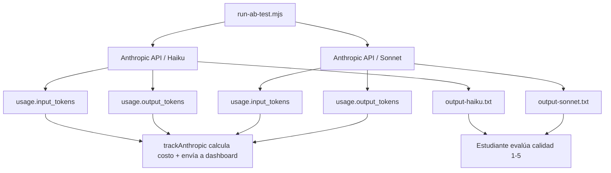

# 🧪 Lab 2 — Test A/B Haiku vs Sonnet con Dashboard

## 📋 Descripción del Lab

**Stack**: `@curso-ai/metrics` + Anthropic SDK + Dashboard del Lab 1
**Duración**: 2-3 horas
**Requisito**: Lab 1 desplegado y funcional en Vercel

### 🎯 Objetivo

Ejecutar un experimento controlado donde un agente genera meta-descriptions SEO para 10 páginas usando **Haiku y Sonnet**, y **el dashboard registra automáticamente** el consumo de tokens y costo.

El estudiante **nunca anota nada manualmente** — `trackAnthropic()` extrae el uso real del response de la API y lo envía al dashboard.

---

## 🏗️ Arquitectura



**Regla**: El dashboard recibe los tokens reales que devuelve la API en `response.usage`. No hay estimación manual.

---

## 📋 Prerequisitos

Antes de empezar, verifica que tienes:

- [ ] **Lab 1 desplegado** en Vercel — URL del dashboard funcional
- [ ] **Node.js 20+** y npm
- [ ] **API key de Anthropic** (`$ANTHROPIC_API_KEY`)
- [ ] **Dashboard URL** (`$DASHBOARD_URL`)

---

## 🛠️ Setup

### 1. Crear carpeta del experimento dentro del repo

```bash
cd curso-ai-engineer/labs/modulo-1
mkdir lab-2-ab-testing && cd lab-2-ab-testing
```

### 2. Inicializar proyecto e instalar dependencias

```bash
npm init -y
npm install @anthropic-ai/sdk
npm install @curso-ai/metrics@workspace:*
```

`@curso-ai/metrics` resuelve al workspace local `packages/metrics/` del repositorio del curso. Al usar `workspace:*`, npm enlaza automáticamente la versión local.

### 3. Crear el prompt

Crea `prompt-meta.md`:

```markdown
Genera una meta-description SEO de máximo 160 caracteres para cada una de estas
10 páginas de una tienda de tecnología:

1. Inicio — Tienda de tecnología con envío gratis
2. Categoría Laptops — Gaming, office y ultrabooks
3. Producto: MacBook Pro M4 — 32GB RAM, 1TB SSD
4. Categoría Audífonos — Inalámbricos, diadema, deportivos
5. Producto: Sony WH-1000XM6 — Cancelación de ruido
6. Categoría Monitores — 4K, gaming, ultrawide
7. Producto: Samsung Odyssey G9 — 49" curvo, 240Hz
8. Página "Sobre Nosotros" — 10 años en el mercado
9. Página de Contacto — Soporte técnico y ventas
10. Blog: "Cómo elegir tu primera laptop gaming"

Formato: "Página: [nombre] | Meta: [descripción]"
```

### 4. Crear el script de ejecución

Crea `run-ab-test.mjs`:

```javascript
import Anthropic from '@anthropic-ai/sdk'
import { trackAnthropic } from '@curso-ai/metrics'
import { readFileSync, writeFileSync } from 'fs'

const client = new Anthropic()
const prompt = readFileSync('prompt-meta.md', 'utf-8')
const dashboardUrl = process.env.DASHBOARD_URL
const project = 'lab-2'

const messages = [{ role: 'user', content: prompt }]

// --- HAIIKU ---
console.log('▶ Ejecutando Haiku...')

const startHaiku = Date.now()
const haikuMsg = await trackAnthropic(
  client.messages.create({
    model: 'claude-haiku-3.5',
    messages,
    max_tokens: 2000,
  }),
  { project, dashboardUrl, endpoint: '/ab-test/haiku' }
)
const haikuTime = ((Date.now() - startHaiku) / 1000).toFixed(1)
writeFileSync('output-haiku.txt', haikuMsg.content[0].text)

console.log(`  Hecho en ${haikuTime}s`)

// --- SONNET ---
console.log('▶ Ejecutando Sonnet...')

const startSonnet = Date.now()
const sonnetMsg = await trackAnthropic(
  client.messages.create({
    model: 'claude-sonnet-4',
    messages,
    max_tokens: 2000,
  }),
  { project, dashboardUrl, endpoint: '/ab-test/sonnet' }
)
const sonnetTime = ((Date.now() - startSonnet) / 1000).toFixed(1)
writeFileSync('output-sonnet.txt', sonnetMsg.content[0].text)

console.log(`  Hecho en ${sonnetTime}s`)

// --- COMPARATIVA ---
console.log('\n=== RESULTADOS ===')
console.log(`Haiku:  ${haikuMsg.usage.input_tokens} in / ${haikuMsg.usage.output_tokens} out | ${haikuTime}s`)
console.log(`Sonnet: ${sonnetMsg.usage.input_tokens} in / ${sonnetMsg.usage.output_tokens} out | ${sonnetTime}s`)
console.log('\nDatos enviados al dashboard. Abre tu dashboard para ver la comparativa.')
```

---

## 🔬 Ejecución

```bash
export ANTHROPIC_API_KEY="sk-ant-..."
export DASHBOARD_URL="https://tu-proyecto.vercel.app"
node run-ab-test.mjs
```

**Salida esperada:**

```
▶ Ejecutando Haiku...
  Hecho en 12.3s
▶ Ejecutando Sonnet...
  Hecho en 28.7s

=== RESULTADOS ===
Haiku:  480 in / 820 out | 12.3s
Sonnet: 480 in / 950 out | 28.7s

Datos enviados al dashboard.
```

---

## 📊 Comparativa en el dashboard

Abre tu dashboard. Ambas ejecuciones aparecen automáticamente. Completa esta tabla:

| Métrica | Haiku | Sonnet |
|---------|-------|--------|
| Tiempo | `___` s | `___` s |
| Input tokens | `___` | `___` |
| Output tokens | `___` | `___` |
| Costo total | `$___` | `$___` |
| Calidad (1-5) | `___` | `___` |

**Calidad**: Lee ambos outputs (`output-haiku.txt`, `output-sonnet.txt`) y asigna un puntaje 1-5 según:
- Precisión: ¿la description coincide con la página?
- Persuasión: ¿invita al clic?
- Claridad: ¿se entiende en un vistazo?

---

## 📝 Conclusión

Crea `conclusion.md` y responde:

1. **¿Cuánto más caro fue Sonnet que Haiku?** (en $ y en %)
2. **¿La calidad de Sonnet justifica el costo adicional?** ¿Por qué?
3. **¿En qué casos usarías Haiku? ¿Y Sonnet?**
4. **¿Qué aprendiste sobre el control de costos con agentes?**

### Ejemplo de conclusión

```markdown
# Conclusión — A/B Test Haiku vs Sonnet

- Haiku: $0.0048, 12s, calidad 3.5/5
- Sonnet: $0.042, 29s, calidad 4.5/5
- Haiku es 8.75x más barato y 9x más rápido

Para meta-descriptions SEO usaré Haiku por defecto.
Solo usaré Sonnet si el cliente requiere textos persuasivos
y el presupuesto lo justifica.
```

---

## ✅ Criterios de éxito

| Objetivo | Criterio |
|----------|----------|
| **Ejecución Haiku** | `run-ab-test.mjs` corre sin errores |
| **Ejecución Sonnet** | Ambos modelos generan 10 meta-descriptions |
| **Métricas en dashboard** | Dashboard muestra ambas ejecuciones con `input_tokens`, `output_tokens`, `cost` reales |
| **Comparativa** | Tabla completada con datos reales del dashboard |
| **Conclusión** | `conclusion.md` escrito |

---

## 🔍 Comandos de verificación

```bash
# Verificar que el dashboard recibe datos
node -e "import { report } from '@curso-ai/metrics'; await report({ project:'test', model:'claude-haiku-3.5', input_tokens:100, output_tokens:200, cached_tokens:0, cost:0.001, endpoint:'/test', dashboardUrl: process.env.DASHBOARD_URL })"

# Revisar outputs
cat output-haiku.txt
cat output-sonnet.txt
```

---

## 🚀 Para estudiantes avanzados

1. **Repite con Opus**: Cambia el modelo a `claude-opus-4` y compara los tres
2. **Automatiza calidad**: Pídele a Claude que evalúe sus propios outputs y asigne puntaje
3. **Promedio múltiple**: Ejecuta cada modelo 3 veces y calcula promedios
4. **Varía el prompt**: Acorta/alarga el prompt y mide el impacto en costo
5. **Agrega caching**: Re-ejecuta el mismo prompt y verifica `cache_read_input_tokens` en el dashboard

---

> **Lab 2 completado** — Ahora sabes medir, comparar y decidir qué modelo usar, todo automatizado vía `trackAnthropic()` y el dashboard.
