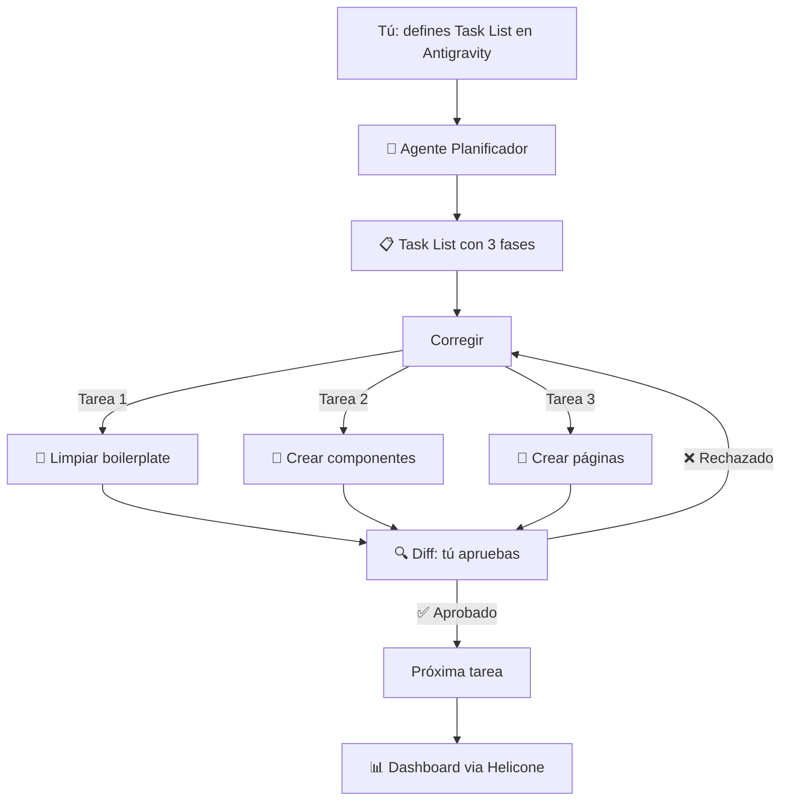

# 🧪 Lab 3 — Andamiaje Principal de TaskFlow AI con Agent Manager

## 📋 Descripción del Lab

**Stack**: Claude Code (Antigravity) + Next.js 15 + Tailwind CSS + Dashboard (via Helicone)
**Duración**: 3-4 horas
**Requisito**: Labs 1 y 2 completados

### 🎯 Objetivo

Usar el **Agent Manager de Antigravity** para planificar y estructurar el andamiaje principal de TaskFlow AI:

- Proyecto Next.js 15 con App Router y Tailwind CSS
- Header, Footer, Navegación responsiva
- Layout principal (RootLayout)
- Estructura de rutas: `/`, `/productos`, `/servicios`, `/contacto`
- Páginas placeholder con contenido mock

**Regla del curso**: Las métricas de tokens viajan automáticamente al dashboard via **Helicone** (el agente CLI expone las métricas a través del proxy). El estudiante nunca anota tokens manualmente.

---

## 🏗️ Arquitectura



---

## 📋 Prerequisitos

Antes de empezar, verifica que tienes:

- [ ] **Claude Code CLI** instalado (`claude --version`)
- [ ] **API key de Anthropic** configurada
- [ ] **Helicone** configurado como proxy (ver instrucciones abajo)
- [ ] **Labs 1 y 2** completados
- [ ] **Node.js 20+** y npm

---

## 🛠️ Setup

### 1. Configurar Helicone para monitoreo automático

Helicone actuará como proxy entre Claude Code y la API de Anthropic, capturando **automáticamente** todas las métricas de tokens y reenviándolas a tu dashboard.

```bash
# Instalar Helicone CLI
npm install -g helicone-cli

# Configurar proxy (sustituye TU_API_KEY)
export HELICONE_API_KEY="sk-helicone-..."
export ANTHROPIC_BASE_URL="http://127.0.0.1:9090/v1"  # Proxy local
```

Alternativamente, si tu dashboard tiene un endpoint de ingesta:
```bash
# Configurar webhook en Helicone → dashboard
# La URL del dashboard se configura en app.helicone.ai
```

> 💡 **¿Sin Helicone?** Puedes usar `syncHelicone()` de `@curso-ai/metrics` para sincronizar después, o configurar el forwarding manual en la UI de Helicone apuntando a `TU_DASHBOARD_URL/api/logs`.

### 2. Crear el proyecto TaskFlow AI

```bash
# Desde la raíz del repo del curso
cd labs/modulo-1/lab-3-agent-manager

# Crear proyecto Next.js 15
npx create-next-app@latest taskflow-ai --typescript --tailwind --app --src-dir
cd taskflow-ai
```

### 3. Inicializar git y conectar con GitHub

```bash
git init
git add .
git commit -m "chore: inicializa Next.js 15 + Tailwind"
gh repo create taskflow-ai --public --source=. --remote=origin --push
```

> Si no tienes `gh` (GitHub CLI), crea el repo manualmente en github.com y usa `git remote add origin <url>`.

---

## 🎬 Ejecución del Lab

### Paso 1: Activar Antigravity

```bash
claude --antigravity
```

Al ejecutarlo, verás la interfaz de Antigravity. El agente estará listo para recibir tu primera instrucción.

### Paso 2: Definir la Task List completa

Dale esta instrucción al agente en Antigravity:

```
Quiero construir el andamiaje principal de TaskFlow AI, una plataforma web 
de servicios técnicos. La estructura debe ser:

FASE 1 — Estructura base:
- Limpiar boilerplate por defecto de Next.js
- Configurar Tailwind CSS con colores corporativos (azul marino #1e3a5f 
  como primario, cyan #0ea5e9 como acento)
- Crear carpetas: components/, lib/, app/page-slices/
- Configurar fuente Inter desde Google Fonts

FASE 2 — Layouts y navegación:
- RootLayout con metadata global (title: "TaskFlow AI", description)
- Header: logo "TaskFlow AI" (enlace a /), navegación con 4 links, 
  botón "Comenzar" CTA, menú hamburguesa en mobile
- Footer: logo, links rápidos, copyright 2026, responsive 3 columnas

FASE 3 — Páginas placeholder:
- Landing Page (/): Hero section con título, subtítulo y CTA
- Productos (/productos): Grid de tarjetas (datos mock)
- Servicios (/servicios): Lista de servicios con íconos (mock)
- Contacto (/contacto): Formulario con nombre, email, mensaje

Genera una Task List completa y estructurada en fases.
NO ejecutes nada todavía. Solo genera la Task List.
```

> ⚡ **Tip**: El agente podría proponer cambios o sugerencias. Revísalos y ajústalos antes de aprobar la Task List.

### Paso 3: Revisar y aprobar la Task List

El agente generará una Task List como esta:

```markdown
# Task List: Andamiaje TaskFlow AI

## [ ] Fase 1: Estructura base
- [ ] Limpiar boilerplate de Next.js
- [ ] Configurar Tailwind con colores personalizados
- [ ] Crear estructura de carpetas
- [ ] Agregar Google Fonts (Inter)

## [ ] Fase 2: Layouts y navegación
- [ ] Configurar RootLayout con metadata
- [ ] Crear componente Header con navegación responsiva
- [ ] Crear componente Footer

## [ ] Fase 3: Páginas placeholder
- [ ] Crear Landing Page (Hero)
- [ ] Crear página de Productos
- [ ] Crear página de Servicios
- [ ] Crear página de Contacto
```

**Revisa**:
- ¿Las fases están en orden lógico?
- ¿Cada tarea es específica?
- ¿Falta alguna tarea? (p.ej., responsive, SEO básico)

**Luego dile**: "Apruebo la Task List. Empieza con la Fase 1."

### Paso 4: Ejecutar y aprobar Diffs

El agente empezará a ejecutar tarea por tarea. Para cada una:

1. **Lee el Diff** — el agente muestra los cambios propuestos
2. **Verifica**:
   - ¿El cambio es correcto?
   - ¿Sigue las convenciones del proyecto?
   - ¿Las importaciones existen?
3. **Decide**:
   - ✅ **Aprobar** — el cambio se aplica
   - ❌ **Rechazar** — el agente ajusta
   - ✏️ **Editar** — haz un comentario específico

> ⚡ **Importante**: No apruebes sin leer. Cada diff es tu oportunidad de mantener calidad.

### Paso 5: Verificar el proyecto completo

Cuando el agente termine todas las tareas:

```bash
# 1. Construir el proyecto (verifica errores de compilación)
npm run build

# 2. Iniciar servidor de desarrollo
npm run dev

# 3. Abrir navegador en http://localhost:3000
```

**Verifica**:
- [ ] Landing Page se ve correctamente
- [ ] Navegación funciona (Header links)
- [ ] /productos, /servicios, /contacto accesibles
- [ ] Diseño responsivo (reduce el ancho del navegador)
- [ ] Footer se renderiza correctamente
- [ ] No hay errores en la consola del navegador

### Paso 6: Push a GitHub

```bash
git add .
git commit -m "feat: andamiaje principal de TaskFlow AI con Antigravity"
git push origin main
```

---

## 📊 Dashboard: Verificar métricas

Abre tu dashboard (del Lab 1). Deberías ver las métricas de esta sesión capturadas automáticamente via Helicone.

Completa esta tabla con los datos reales del dashboard:

| Métrica | Valor |
|---------|-------|
| Proyecto | `lab-3` |
| Modelo(s) usado(s) | `________` |
| Total input tokens | `________` |
| Total output tokens | `________` |
| Costo total estimado | `$________` |
| Turns totales | `________` |

> 💡 ¿No ves métricas? Revisa la configuración de Helicone o usa `syncHelicone()` desde `@curso-ai/metrics` como respaldo.

---

## 📝 Conclusión

Crea `conclusion.md` en `labs/modulo-1/lab-3-agent-manager/` y responde:

1. **¿Cuánto tiempo tomó vs lo esperado?** (3-4 horas estimadas)
2. **¿Cuántos Diffs aprobaste? ¿Cuántos rechazaste?** ¿Por qué?
3. **¿El agente respetó la Task List o se desvió?**
4. **¿Qué aprendiste sobre el control de calidad con Diffs?**
5. **¿Cómo se compara esta experiencia con escribir el código manualmente?**

### Ejemplo de conclusión

```markdown
# Conclusión — Lab 3: Andamiaje con Agent Manager

- Tiempo real: 2h 45min (vs 3-4h estimado)
- Diffs aprobados: 12 | Rechazados: 1 (el Header no era responsivo)
- El agente respetó la Task List al 100%
- Aprendizaje: revisar Diffs es más rápido que escribir código,
  y previene errores antes de que ocurran
- Los tokens se registraron automáticamente en el dashboard
  via Helicone — sin intervención manual
```

---

## ✅ Criterios de éxito

| Objetivo | Criterio |
|----------|----------|
| **Task List definida** | El agente generó una Task List con 3+ fases y 8+ tareas |
| **Ejecución completa** | Todas las tareas se completaron y aprobaron |
| **Build exitoso** | `npm run build` sin errores |
| **Navegación funcional** | 4 rutas navegables desde el Header |
| **Diseño responsivo** | Header se adapta a mobile (hamburguesa) |
| **Git push** | Código subido a GitHub |
| **Métricas en dashboard** | Dashboard muestra tokens del agente (via Helicone) |
| **Conclusión** | `conclusion.md` escrito |

---

## 🔍 Comandos de verificación

```bash
# Verificar build
cd labs/modulo-1/lab-3-agent-manager/taskflow-ai && npm run build

# Verificar estructura del proyecto
ls -la app/ components/

# Verificar git status
git status

# Verificar que Helicone está capturando
# (Abre app.helicone.ai y revisa los logs)
```

---

## 🚀 Para estudiantes avanzados

1. **Agrega animaciones**: Pídele al agente que agregue transiciones y animaciones suaves con Tailwind
2. **Modo oscuro**: Implementa theme toggle con `next-themes`
3. **SEO**: Agrega meta tags por página y structured data (JSON-LD)
4. **Múltiples agentes**: Usa Antigravity para que un agente construya y otro revise
5. **Automatiza Helicone**: Configura el forwarding automático de Helicone a tu dashboard

---

## 🐛 Troubleshooting

| Problema | Solución |
|----------|----------|
| `claude --antigravity` no funciona | Actualiza Claude Code: `npm update -g @anthropic-ai/claude-code` |
| El agente no genera Task List | Sé más específico en la instrucción inicial |
| El build falla | Copia el error y pídele al agente que lo corrija |
| Helicone no muestra datos | Verifica `HELICONE_API_KEY` y el proxy `ANTHROPIC_BASE_URL` |
| No veo las métricas en el dashboard | Usa `syncHelicone()` de `@curso-ai/metrics` como respaldo |

---

> **Lab 3 completado** — Tu proyecto TaskFlow AI tiene andamiaje profesional, creado con agentes orquestados y métricas automáticas en el dashboard.
