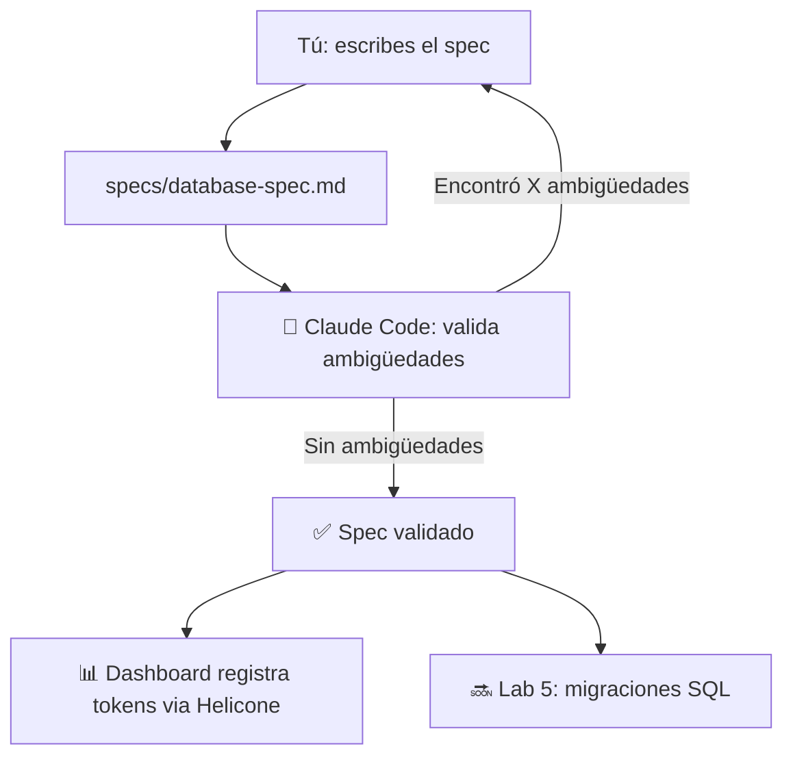

# 🧪 Lab 4 — Spec Atómico para el Modelo de Datos

## 📋 Descripción del Lab

**Stack**: Markdown + Claude Code + Dashboard (via Helicone)
**Duración**: 3-4 horas (~15K-30K tokens)
**Requisito**: Lab 3 completado (proyecto TaskFlow AI creado)

### 🎯 Objetivo

Escribir un **Spec completo y atómico** siguiendo el protocolo **OpenSpec** para el modelo de datos de TaskFlow AI. Este spec define las 7 entidades del sistema y será la base para generar migraciones SQL en el Lab 5.

**El estudiante nunca anota tokens manualmente** — el agente CLI reporta automáticamente al dashboard via Helicone.

---

## 🏗️ Arquitectura



---

## 📋 Prerequisitos

Antes de empezar, verifica que tienes:

- [ ] **Lab 3 completado** — proyecto TaskFlow AI en `labs/modulo-1/lab-3-agent-manager/taskflow-ai/`
- [ ] **Claude Code CLI** instalado y autenticado
- [ ] **Helicone** configurado (siguiendo los pasos del Lab 3)
- [ ] **Git** inicializado en el proyecto

---

## 📁 Estructura esperada

```
taskflow-ai/
├── specs/                    ← (CREAR)
│   └── database-spec.md      ← (CREAR)
├── app/
├── components/
├── lib/
└── ...
```

---

## 🛠️ Setup

### 1. Ir al proyecto TaskFlow AI

```bash
cd labs/modulo-1/lab-3-agent-manager/taskflow-ai
```

### 2. Crear la carpeta de specs

```bash
mkdir -p specs
```

---

## 📝 El Spec: database-spec.md

Crea `specs/database-spec.md` con el siguiente contenido. **No copies y pegues todo de una vez** — escríbelo sección por sección para que entiendas cada parte.

### Sección 1: Metadata

```markdown
# OpenSpec — Modelo de Datos de TaskFlow AI

**Versión**: 1.0
**Autor**: [Tu Nombre]
**Fecha**: Julio 2026
**Estado**: Borrador
```

### Sección 2: Contexto

```markdown
## 1. Contexto

### 1.1 Propósito
TaskFlow AI es una plataforma web de servicios técnicos donde los usuarios
pueden navegar un catálogo de productos y servicios, agregar items al carrito,
realizar pedidos y dejar reseñas.

### 1.2 Alcance
Este spec cubre 7 entidades del modelo de datos:
users, categories, products, cart_items, orders, order_items, reviews.
No cubre autenticación (Supabase Auth), ni facturación externa.

### 1.3 Stack destino
- Base de datos: Supabase (PostgreSQL 15+)
- Extensión: pgvector (para embeddings en Módulo 4)
- Auth: Supabase Auth
```

### Sección 3: Definición de datos

Aquí va el grueso del spec. Cada entidad debe tener:

- **CREATE TABLE** con SQL
- **Tabla de campos** con nombre, tipo, constraints y descripción
- **Reglas de negocio** específicas de esa entidad

#### 3.1 Entidad: `users`

````markdown
### 2.1 Entidad: `users`

```sql
CREATE TABLE public.users (
  id UUID PRIMARY KEY REFERENCES auth.users(id) ON DELETE CASCADE,
  full_name TEXT NOT NULL,
  avatar_url TEXT,
  role TEXT NOT NULL DEFAULT 'customer' CHECK (role IN ('customer', 'admin')),
  created_at TIMESTAMPTZ NOT NULL DEFAULT now(),
  updated_at TIMESTAMPTZ NOT NULL DEFAULT now(),
  deleted_at TIMESTAMPTZ
);
```

| Campo | Tipo | Constraints | Descripción |
|-------|------|-------------|-------------|
| id | UUID | PK, FK → auth.users | ID de Supabase Auth |
| full_name | TEXT | NOT NULL | Nombre completo |
| avatar_url | TEXT | nullable | URL del avatar |
| role | TEXT | NOT NULL, DEFAULT 'customer' | customer o admin |
| created_at | TIMESTAMPTZ | NOT NULL | Fecha de registro |
| updated_at | TIMESTAMPTZ | NOT NULL | Última actualización |
| deleted_at | TIMESTAMPTZ | nullable | Soft delete |

**Reglas**:
- Solo el usuario o un admin modifica full_name y avatar_url
- role solo lo cambia un admin
- Soft delete: los pedidos históricos se conservan
````

#### 3.2 Entidad: `categories`

````markdown
### 2.2 Entidad: `categories`

```sql
CREATE TABLE public.categories (
  id UUID PRIMARY KEY DEFAULT gen_random_uuid(),
  name TEXT NOT NULL,
  slug TEXT NOT NULL UNIQUE,
  description TEXT,
  image_url TEXT,
  parent_id UUID REFERENCES public.categories(id) ON DELETE SET NULL,
  sort_order INTEGER NOT NULL DEFAULT 0,
  is_active BOOLEAN NOT NULL DEFAULT true,
  created_at TIMESTAMPTZ NOT NULL DEFAULT now(),
  updated_at TIMESTAMPTZ NOT NULL DEFAULT now(),
  deleted_at TIMESTAMPTZ
);
```

| Campo | Tipo | Constraints | Descripción |
|-------|------|-------------|-------------|
| id | UUID | PK | ID único |
| name | TEXT | NOT NULL | Nombre visible |
| slug | TEXT | NOT NULL, UNIQUE | Slug para URL |
| description | TEXT | nullable | Descripción |
| parent_id | UUID | FK → categories | Categoría padre |
| is_active | BOOLEAN | DEFAULT true | Visible en web |

**Reglas**:
- Máximo 3 niveles de profundidad
- Al desactivar una categoría, sus productos no se muestran
- Slug único entre categorías activas
````

#### 3.3 Entidad: `products`

````markdown
### 2.3 Entidad: `products`

```sql
CREATE TABLE public.products (
  id UUID PRIMARY KEY DEFAULT gen_random_uuid(),
  category_id UUID NOT NULL REFERENCES public.categories(id) ON DELETE RESTRICT,
  name TEXT NOT NULL,
  slug TEXT NOT NULL UNIQUE,
  description TEXT NOT NULL,
  short_description TEXT,
  price DECIMAL(10,2) NOT NULL CHECK (price >= 0),
  compare_at_price DECIMAL(10,2) CHECK (compare_at_price >= 0),
  cost_price DECIMAL(10,2) CHECK (cost_price >= 0),
  sku TEXT UNIQUE,
  stock_quantity INTEGER NOT NULL DEFAULT 0 CHECK (stock_quantity >= 0),
  is_active BOOLEAN NOT NULL DEFAULT true,
  is_featured BOOLEAN NOT NULL DEFAULT false,
  images TEXT[] DEFAULT '{}',
  metadata JSONB DEFAULT '{}',
  embedding VECTOR(1536),
  created_at TIMESTAMPTZ NOT NULL DEFAULT now(),
  updated_at TIMESTAMPTZ NOT NULL DEFAULT now(),
  deleted_at TIMESTAMPTZ
);
```

| Campo | Tipo | Constraints | Descripción |
|-------|------|-------------|-------------|
| id | UUID | PK | ID único |
| category_id | UUID | FK, NOT NULL | Categoría |
| name | TEXT | NOT NULL | Nombre del producto |
| slug | TEXT | NOT NULL, UNIQUE | URL amigable |
| price | DECIMAL(10,2) | NOT NULL, CHECK >= 0 | Precio de venta |
| stock_quantity | INTEGER | DEFAULT 0 | Stock disponible |

**Reglas**:
- No eliminar categoría con productos (RESTRICT)
- compare_at_price > price (si existe)
- stock = 0 → mostrar "Agotado"
- SKU único global
````

> ⚡ **Completa las entidades restantes** siguiendo el mismo patrón.

Las entidades que faltan son:

#### 3.4 `cart_items`
- user_id (FK → users), product_id (FK → products), quantity
- UNIQUE(user_id, product_id)
- quantity > 0

#### 3.5 `orders`
- user_id (FK → users), status (ENUM), total_amount, addresses
- Estados: pending → confirmed → processing → shipped → delivered
- Desde cualquier estado se puede cancelar

#### 3.6 `order_items`
- order_id (FK → orders), product_id (FK → products), quantity, unit_price, total_price
- unit_price guarda el precio al momento de la compra

#### 3.7 `reviews`
- product_id (FK → products), user_id (FK → users), rating (1-5), content
- UNIQUE(product_id, user_id)
- is_verified_purchase, is_approved

### Sección 4: Reglas de negocio generales

```markdown
## 3. Reglas de Negocio General

### 3.1 Carrito
- Por usuario autenticado. No hay invitados.
- Al hacer checkout, el carrito se convierte en pedido y se vacía.

### 3.2 Pedidos
- total_amount calculado en la API al crear el pedido
- Stock descuenta al confirmar el pedido
- Si se cancela, el stock se restaura

### 3.3 Reseñas
- Solo se puede reseñar si se ha comprado el producto
- Ordenadas por fecha descendente
```

### Sección 5: Seguridad (RLS)

```markdown
## 4. Seguridad (RLS)

### 4.1 users
```sql
CREATE POLICY "users_read_own" ON public.users
  FOR SELECT USING (auth.uid() = id);

CREATE POLICY "users_read_admin" ON public.users
  FOR SELECT USING (auth.jwt() ->> 'role' = 'admin');

CREATE POLICY "users_update_own" ON public.users
  FOR UPDATE USING (auth.uid() = id);
```

### 4.2 categories
```sql
CREATE POLICY "categories_read_active" ON public.categories
  FOR SELECT USING (is_active = true AND deleted_at IS NULL);

CREATE POLICY "categories_admin_all" ON public.categories
  FOR ALL USING (auth.jwt() ->> 'role' = 'admin');
```

### 4.3 products
```sql
CREATE POLICY "products_read_active" ON public.products
  FOR SELECT USING (is_active = true AND deleted_at IS NULL);

CREATE POLICY "products_admin_all" ON public.products
  FOR ALL USING (auth.jwt() ->> 'role' = 'admin');
```
```

> ⚡ **Completa las políticas RLS** para cart_items, orders, order_items y reviews siguiendo el mismo patrón.

### Sección 6: Criterios de aceptación

```markdown
## 5. Criterios de Aceptación

Este spec se considera **validado** cuando:

- [ ] Las 7 entidades están definidas con todos sus campos y tipos
- [ ] Todas las relaciones entre entidades están documentadas
- [ ] Las reglas de negocio están especificadas sin ambigüedad
- [ ] Cada tabla tiene su política RLS definida
- [ ] Un agente de IA confirma que **no encuentra ambigüedades**
```

---

## ✅ Validación del Spec

Cuando hayas completado el spec, valídalo con Claude Code:

### 1. Validar ambigüedades

```bash
claude -p "Lee specs/database-spec.md y dime qué ambigüedades encuentras. Busca: tipos incorrectos, relaciones sin FK, reglas de negocio faltantes, RLS incompleto."
```

Claude analizará el spec y te dirá qué falta o qué es ambiguo.

### 2. Refinar

Corrige cada ambigüedad que encuentre Claude. Luego valida de nuevo:

```bash
claude -p "Vuelve a leer specs/database-spec.md después de las correcciones. ¿Queda alguna ambigüedad?"
```

### 3. Criterio de éxito

El spec está listo cuando Claude responda algo como:

> "**No encontré ambigüedades en el spec. Las 7 entidades están completas, las relaciones son correctas, las reglas de negocio están claras y el RLS cubre todas las tablas.**"

---

## 📊 Dashboard: Verificar métricas

Abre tu dashboard. Las métricas de esta sesión (tokens consumidos al validar con Claude) deberían aparecer automáticamente via Helicone.

Completa esta tabla con los datos reales:

| Métrica | Valor |
|---------|-------|
| Proyecto | `lab-4` |
| Modelo usado | `________` |
| Total input tokens | `________` |
| Total output tokens | `________` |
| Costo total | `$________` |
| Validaciones realizadas | `________` (cuántas veces preguntaste a Claude) |

---

## 📝 Conclusión

Crea `conclusion.md` en `labs/modulo-2/lab-4-spec-base-datos/` y responde:

1. **¿Cuántas ambigüedades encontró Claude en tu primera versión?**
2. **¿Cuál fue la ambigüedad más difícil de corregir?**
3. **¿Cuánto tiempo te tomó vs lo estimado (3-4 horas)?**
4. **¿Cómo crees que este spec te ayudará en el Lab 5?**

### Ejemplo de conclusión

```markdown
# Conclusión — Lab 4: Spec Atómico

- Ambigüedades encontradas por Claude: 3
  - Faltaba UNIQUE en slug de categories
  - No especifiqué ON DELETE en cart_items
  - Faltaban políticas RLS para order_items
- Más difícil: las reglas de negocio de orders (estados)
- Tiempo real: 2h 30min (spec) + 30min (validación)
- El spec me da confianza para el Lab 5 — sé exactamente
  qué migraciones voy a generar
```

---

## ✅ Criterios de éxito

| Objetivo | Criterio |
|----------|----------|
| **Carpeta specs/** | Existe en la raíz del proyecto |
| **7 entidades** | Definen campos, tipos, constraints y relaciones |
| **Reglas de negocio** | Documentadas por entidad y generales |
| **Políticas RLS** | Definidas para cada tabla |
| **Validación IA** | Claude confirma "sin ambigüedades" |
| **Commit** | `git add specs/ && git commit` |
| **Dashboard** | Muestra los tokens consumidos |

---

## 🔍 Comandos de verificación

```bash
# Verificar que el spec existe
ls -la specs/database-spec.md

# Verificar que git lo trackea
git status

# Validar de nuevo (opcional)
claude -p "Dame un resumen de specs/database-spec.md: cuántas entidades, qué relaciones tienen, qué RLS definiste"
```

---

## 🚀 Para estudiantes avanzados

1. **Spec de API**: Crea `specs/api-spec.md` con los endpoints REST que consumirá el frontend
2. **Seed data spec**: Agrega una sección con datos de ejemplo para poblar la BD
3. **Diagrama ER**: Agrega un diagrama Mermaid de entidad-relación al spec
4. **Índices**: Revisa y agrega índices adicionales para consultas frecuentes

---

## 🐛 Troubleshooting

| Problema | Solución |
|----------|----------|
| Claude no encuentra ambigüedades obvias | Sé más específico: "busca errores de tipos, FK faltantes, RLS incompleto" |
| No sé qué más agregar al spec | Revisa el spec de ejemplo en `specs/database-spec.md` del repo del curso |
| El spec es muy largo | No pasa nada — entre más detallado, mejor ejecutará el agente |
| Helicone no muestra datos | Verifica que `HELICONE_API_KEY` esté configurada |

---

## 💡 Tips del instructor

- **Escribe el spec en español**, los nombres de tablas y campos en inglés (convención)
- **No copies y pegues** el spec de ejemplo — escríbelo tú mismo para aprender la estructura
- **Usa el spec como documento vivo** — cuando agregues funcionalidad, actualiza el spec primero
- **El spec es tu mejor documentación** — cualquier dev que llegue al proyecto debe leer el spec

---

> **Lab 4 completado** — Tienes un spec profesional del modelo de datos de TaskFlow AI, validado por IA y listo para implementar en el Lab 5.
