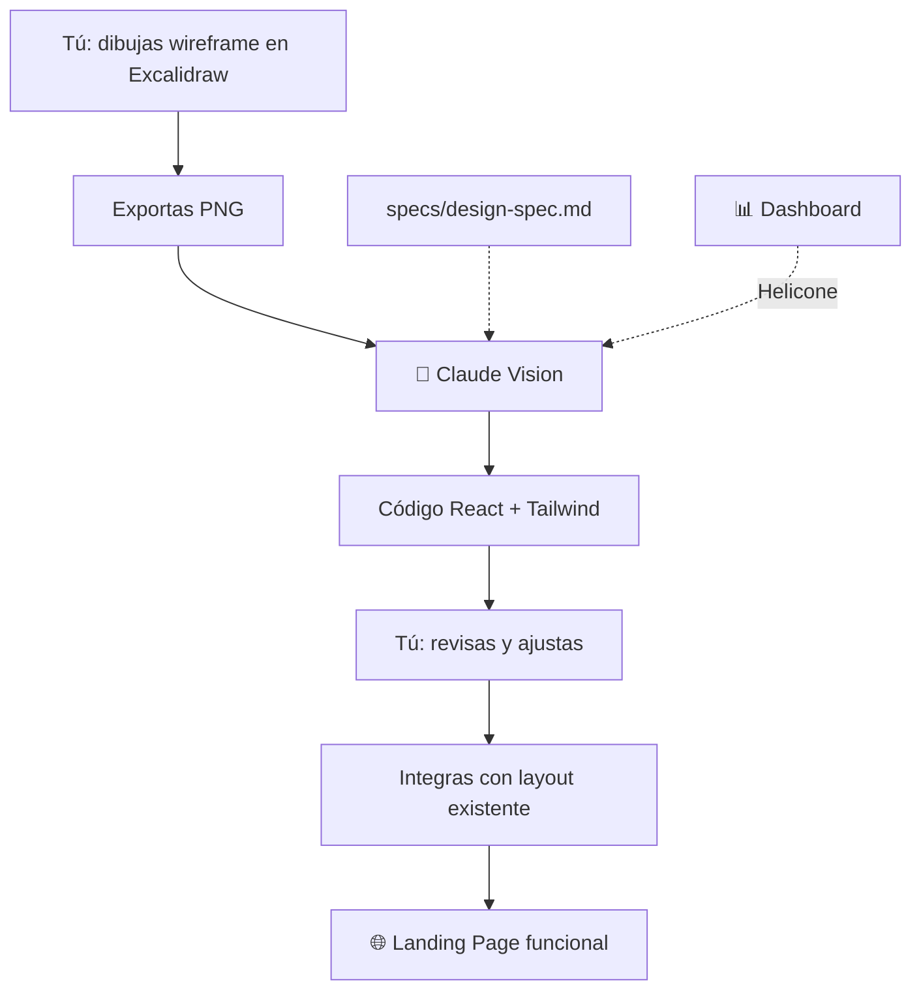

# 🧪 Lab 6 — Landing Page y Galería desde Wireframe

## 📋 Descripción del Lab

**Stack**: Claude Vision + Tailwind CSS + Shadcn/UI + Dashboard (via Helicone)
**Duración**: 4-5 horas (~30K-60K tokens)
**Requisito**: Módulo 2 completado (proyecto con BD en Supabase)

### 🎯 Objetivo

Convertir un **wireframe dibujado a mano** (en Excalidraw) en una **Landing Page funcional** con galería de productos, usando Claude Vision para la generación de código.

**Regla del curso**: Las métricas se registran automáticamente al usar Claude Code (via Helicone).

---

## 🏗️ Arquitectura



---

## 📋 Prerequisitos

- [ ] **Módulo 2 completado** — BD en Supabase con datos
- [ ] **Proyecto TaskFlow AI** del Lab 3 en `labs/modulo-1/lab-3-agent-manager/taskflow-ai/`
- [ ] **Claude Code CLI** instalado y autenticado
- [ ] **Helicone** configurado
- [ ] **Excalidraw** — https://excalidraw.com (gratis, sin cuenta)

---

## 🛠️ Setup

### 1. Ir al proyecto

```bash
cd labs/modulo-1/lab-3-agent-manager/taskflow-ai
```

### 2. Configurar Shadcn/UI

```bash
# Inicializar
npx shadcn@latest init

# Responder:
# Style: Default
# Base color: Slate
# CSS variables: Yes

# Agregar componentes
npx shadcn@latest add button card input
```

### 3. Verificar colores corporativos en Tailwind

Asegúrate que `tailwind.config.ts` tenga los colores del Lab 3:

```typescript
import type { Config } from 'tailwindcss'

const config: Config = {
  content: ['./app/**/*.{ts,tsx}', './components/**/*.{ts,tsx}'],
  theme: {
    extend: {
      colors: {
        primary: '#1e3a5f',
        accent: '#0ea5e9',
      },
    },
  },
  plugins: [],
}

export default config
```

### 4. (Opcional) Crear spec de diseño

Crea `specs/design-spec.md` para documentar el sistema de diseño:

```markdown
# OpenSpec — Sistema de Diseño TaskFlow AI

## Colores
- primary: #1e3a5f (azul marino) — headers, botones principales
- accent: #0ea5e9 (cyan) — CTAs, hover, links
- background: #ffffff
- surface: #f8fafc — cards, secciones alternas
- text-primary: #1a1a2e
- text-secondary: #64748b

## Tipografía
- Font: Inter (Google Fonts)
- H1: text-4xl md:text-5xl font-bold tracking-tight
- H2: text-2xl md:text-3xl font-semibold
- Body: text-base leading-relaxed text-gray-600

## Espaciado
- Section padding: py-16 md:py-24
- Card padding: p-6
- Grid gap: gap-6 md:gap-8
- Max width: max-w-7xl mx-auto px-4 sm:px-6 lg:px-8

## Bordes
- Border radius: rounded-lg (0.5rem)
- Card border: border border-gray-200
- Shadow: shadow-sm hover:shadow-md transition
```

---

## 🎬 Ejecución del Lab

### Paso 1: Dibujar el wireframe en Excalidraw

1. Abre [Excalidraw](https://excalidraw.com)
2. Dibuja la **Landing Page** con estas secciones:

```
┌─────────────────────────────────────┐
│  HEADER (ya existe del Lab 3)       │
├─────────────────────────────────────┤
│  HERO SECTION                       │
│  ┌─────────────────────────────┐    │
│  │ Título grande               │    │
│  │ Subtítulo descriptivo       │    │
│  │ [Comenzar] [Saber más]      │    │
│  └─────────────────────────────┘    │
├─────────────────────────────────────┤
│  FEATURES (3 columnas)              │
│  ┌──────┐ ┌──────┐ ┌──────┐       │
│  │ Icon │ │ Icon │ │ Icon │       │
│  │ Tit  │ │ Tit  │ │ Tit  │       │
│  │ Desc  │ │ Desc  │ │ Desc  │       │
│  └──────┘ └──────┘ └──────┘       │
├─────────────────────────────────────┤
│  GALERÍA DESTACADA                  │
│  ┌────┐ ┌────┐ ┌────┐             │
│  │Img │ │Img │ │Img │             │
│  │Nm  │ │Nm  │ │Nm  │             │
│  │$99 │ │$99 │ │$99 │             │
│  └────┘ └────┘ └────┘             │
├─────────────────────────────────────┤
│  CTA BANNER                         │
│  "Descubre todos nuestros..."       │
│  [Ver catálogo]                     │
├─────────────────────────────────────┤
│  FOOTER (ya existe del Lab 3)       │
└─────────────────────────────────────┘
```

> 💡 **Tip**: No necesitas ser diseñador. Usa rectángulos y texto. Lo importante es la **estructura**, no la estética.

3. Exporta como **PNG** (File → Export → PNG)

### Paso 2: Subir a Claude Vision y generar código

```bash
claude --antigravity
```

Dale esta instrucción (reemplaza `ruta/al/wireframe.png` con la ruta real):

```
Tengo un wireframe de la Landing Page de TaskFlow AI,
una plataforma de servicios técnicos.

Archivo: ruta/al/wireframe.png

Convierte este wireframe en código Next.js con TypeScript
y Tailwind CSS. Crea el archivo app/page.tsx.

Sistema de diseño:
- Primary: #1e3a5f (azul marino)
- Accent: #0ea5e9 (cyan)
- Font: Inter (Google Fonts)

Requisitos:
- Hero section con título, subtítulo y 2 botones CTA
- Features section con 3 columnas (responsive)
- Galería destacada con productos mock (3 items)
- Banner CTA promocional
- Mobile-first, diseño responsivo
- Usa los componentes de Shadcn/UI si aplica (Button, Card)
- Imágenes con next/image y placeholder
```

> ⚡ **Tip**: Claude Vision procesa la imagen y genera el código. Si el resultado no es perfecto, NO empieces de nuevo. Haz ajustes incrementales.

### Paso 3: Revisar el código generado

Revisa estos puntos:

```typescript
// ✅ ¿Estructura correcta? (Hero → Features → Galería → Banner)
// ✅ ¿Usó los colores del sistema de diseño?
// ✅ ¿Es responsive? (prueba reduciendo el navegador)
// ✅ ¿Usa next/image para imágenes?
// ✅ ¿Los componentes son consistentes con el layout existente?
```

**Correcciones comunes** y cómo pedirlas:

```bash
# Corregir colores
claude -p "Cambia bg-blue-500 por bg-[#0ea5e9] en todos los botones CTA"

# Ajustar responsive
claude -p "La sección features debe ser 1 columna en mobile y 3 en desktop"

# Agregar animaciones
claude -p "Agrega transición hover a las cards con shadow-md"
```

### Paso 4: Integrar con el layout existente

El proyecto ya tiene un layout con Header y Footer del Lab 3. El archivo `app/page.tsx` solo debe contener el contenido de la Landing Page (sin Header/Footer).

Verifica que `app/layout.tsx` tenga la estructura:

```typescript
import Header from '@/components/Header'
import Footer from '@/components/Footer'

export default function RootLayout({ children }) {
  return (
    <html lang="es">
      <body>
        <Header />
        <main>{children}</main>
        <Footer />
      </body>
    </html>
  )
}
```

Si tu `app/page.tsx` incluye Header o Footer, elimínalos (ya están en el layout).

### Paso 5: Verificar en el navegador

```bash
npm run dev
```

Abre `http://localhost:3000` y verifica:

- [ ] Landing Page se ve completa (Hero, Features, Galería, Banner)
- [ ] Diseño responsivo (prueba en mobile con F12)
- [ ] Header y Footer visibles (del Lab 3)
- [ ] Sin errores en consola del navegador
- [ ] Imágenes cargan correctamente

### Paso 6: Generar la galería con Claude Vision (opcional avanzado)

Si quieres que la galería tenga productos más realistas, dibuja un wireframe específico para la galería y pídele a Claude Vision que genere el componente:

```bash
claude -p "Archivo: galeria-wireframe.png
Convierte este wireframe en un componente de galería de productos.
Genera components/ProductGallery.tsx con datos mock.
Usa Card de Shadcn/UI. Grid responsivo."
```

---

## 📊 Dashboard: Verificar métricas

Abre tu dashboard. Las métricas de esta sesión se registran automáticamente via Helicone.

| Métrica | Valor |
|---------|-------|
| Proyecto | `lab-6` |
| Modelo usado | `________` |
| Total input tokens | `________` |
| Total output tokens | `________` |
| Costo total | `$________` |
| Correcciones solicitadas | `________` |

---

## 📝 Conclusión

Crea `labs/modulo-3/lab-6-landing-wireframe/conclusion.md` y responde:

1. **¿Qué tan preciso fue Claude Vision al interpretar tu wireframe?**
2. **¿Cuántas correcciones necesitaste? ¿Cuáles fueron las más comunes?**
3. **¿Cómo se compara este flujo con escribir el código manualmente?**
4. **¿El sistema de diseño ayudó a mantener consistencia? ¿Por qué?**

### Ejemplo de conclusión

```markdown
# Conclusión — Lab 6: Landing Page desde Wireframe

- Claude Vision interpretó el 80% del wireframe correctamente
- 2 correcciones: colores (usó blue-500 en vez de accent) y
  espaciado (muy compacto en mobile)
- Comparado con escribir manualmente: 5x más rápido
- El sistema de diseño me salvó de tener que corregir cada
  componente individualmente
- Próximo paso: conectar la galería con datos reales de Supabase
```

---

## ✅ Criterios de éxito

| Objetivo | Criterio |
|----------|----------|
| **Shadcn/UI configurado** | `npx shadcn@latest init` completado |
| **Wireframe dibujado** | Exportado como PNG desde Excalidraw |
| **Código generado** | Claude Vision produjo código ejecutable |
| **Colores consistentes** | Usa primary (#1e3a5f) y accent (#0ea5e9) |
| **Responsive** | Funciona en mobile y desktop |
| **Integrado con layout** | Header y Footer del Lab 3 visibles |
| **Sin errores** | `npm run dev` sin errores de compilación |
| **Dashboard** | Tokens registrados via Helicone |

---

## 🔍 Comandos de verificación

```bash
# Verificar que Shadcn/UI está configurado
ls components/ui/button.tsx

# Verificar que la app compila
npm run build

# Verificar layout
cat app/layout.tsx

# Verificar colores en Tailwind
cat tailwind.config.ts | grep -A5 colors
```

---

## 🚀 Para estudiantes avanzados

1. **Modo oscuro**: Implementa `next-themes` y agrega variantes dark a los componentes
2. **Animaciones**: Agrega `framer-motion` para animaciones de entrada
3. **Múltiples wireframes**: Sube 3 wireframes (mobile, tablet, desktop) para mayor precisión
4. **Design tokens**: Crea un archivo `design-tokens.json` y pásaselo a Claude Vision como contexto
5. **Prueba A/B visual**: Genera 2 versiones de la Landing con prompts diferentes y compara

---

## 🐛 Troubleshooting

| Problema | Solución |
|----------|----------|
| Claude Vision no entiende el wireframe | Tu wireframe es muy abstracto. Agrega más texto/etiquetas |
| Los colores no coinciden | El prompt no incluyó los colores. Agrégarlos explícitamente |
| El código no compila | Claude puede generar TSX con errores. Pídele que lo corrija |
| No es responsive | Falta el flag mobile-first en el prompt. Agrégalo |
| Header/Footer duplicados | El código generado incluye header/footer. Elimínalos (ya están en layout) |

---

> **Lab 6 completado** — Convertiste un dibujo en una Landing Page funcional. En el Lab 7 vas a conectar la galería con datos reales de Supabase.
