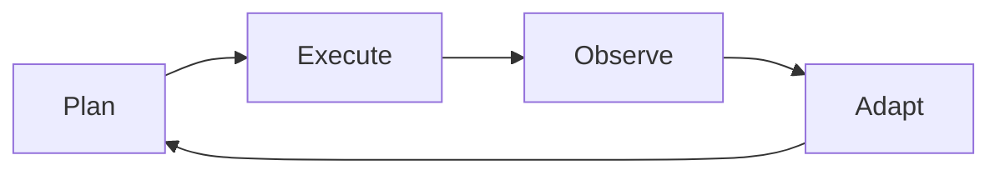
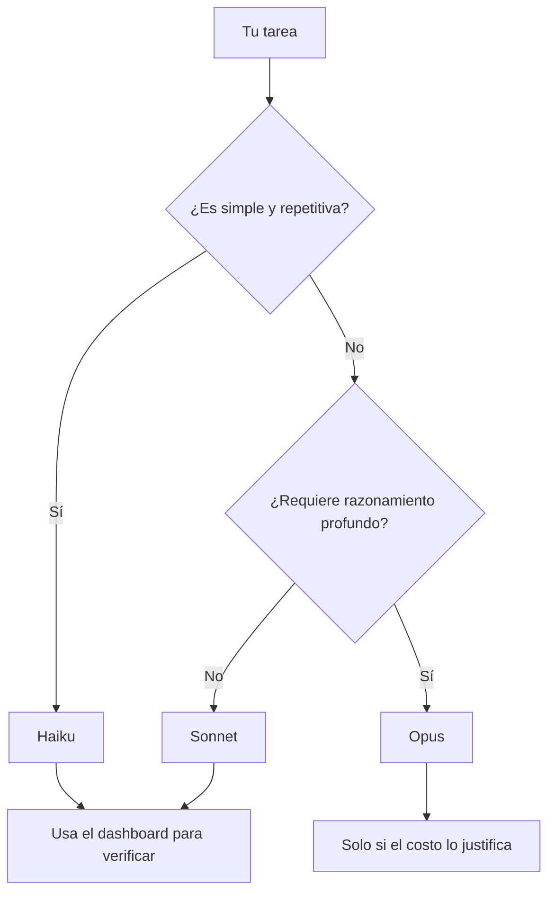

# 🎙️ GUION DE GRABACIÓN — Módulo 1, Sesión 1.2
## **Tu Primer Agente Productivo**
**Duración target**: 35 min teoría + 10 min demo + 5 min intro/outro = **50 min total**
**Formato**: Video talking-head + screen recording (demo) + slides
**Idioma**: Español (LATAM, neutro)

---

## 📋 ESTRUCTURA DEL GUION

| Bloque | Tiempo | Tipo | Notas |
|--------|--------|------|-------|
| 0. Intro gancho | 2 min | Talking head | Conectar con sesión anterior |
| 1. Arquitectura de un agente | 8 min | Slides | System prompt → Tools → Context → Output |
| 2. Claude Code CLI | 10 min | Screen recording | Instalación + configuración + primer uso |
| 3. Cuándo usar cada modelo | 7 min | Slides + tabla | Haiku vs Sonnet vs Opus |
| 4. Control de costos | 5 min | Slides | Turns, caching, batch |
| 5. Demo en vivo | 10 min | Screen recording | A/B test real: Haiku vs Sonnet |
| 6. Preview del Lab 2 | 3 min | Talking head | Qué van a construir |
| 7. Cierre y tarea | 2 min | Talking head | Call to action |

**Total teoría**: ~35 min | **Total con demos**: ~50 min

---

## 🎬 BLOQUE 0: INTRO GANCHO (2 min)

**[CÁMARA: Primer plano, misma línea visual que la sesión 1.1]**

> "Bienvenido de vuelta a la **Sesión 1.2 del curso AI Engineer**.
>
> En la sesión anterior construiste **tu dashboard de monitoreo de tokens**. Ahora tienes visibilidad. Sabes cuánto cuesta cada llamado.
>
> Hoy vas a dar el siguiente paso: **vas a crear tu primer agente de código productivo**.
>
> No es teoría. Vas a instalar Claude Code, configurarlo, y ejecutar **un experimento real**: el mismo trabajo con Haiku y con Sonnet, midiendo con tu dashboard cuál es más rentable.
>
> Al final de esta sesión, **no solo tendrás un agente funcionando. Sabrás exactamente cuándo usar cada modelo y cuánto te ahorras**.
>
> ¿Listo? Vamos."

---

## 🏗️ BLOQUE 1: ARQUITECTURA DE UN AGENTE (8 min)

**[SLIDE 1: "¿Qué es un agente de código?"]**

> "Antes de instalar nada, entendamos **qué estamos creando**.
>
> Un agente de código no es un chatbot. Es un **sistema que escribe, lee, modifica y ejecuta código** por ti."

**[SLIDE 2: Ciclo del agente — Plan → Execute → Observe → Adapt]**



> "El ciclo es simple:
> 1. **Plan** — El agente analiza tu request y decide qué herramientas usar
> 2. **Execute** — Ejecuta comandos, edita archivos, busca en el código
> 3. **Observe** — Lee el resultado: output, errores, tests
> 4. **Adapt** — Ajusta su enfoque si algo falla
>
> Este ciclo se repite **hasta que la tarea está completa** o se alcanza el límite de turns."

**[SLIDE 3: Anatomía de un agente]**

```
┌─────────────────────────────────────────┐
│             System Prompt                │ ← Personalidad + reglas
├─────────────────────────────────────────┤
│         Herramientas disponibles         │ ← Bash, FS, Edit, Search, MCP
├─────────────────────────────────────────┤
│              Contexto actual             │ ← Archivos abiertos, historial
├─────────────────────────────────────────┤
│                Output                    │ ← Código, comandos, texto
└─────────────────────────────────────────┘
```

> "Cuatro componentes:
> - **System Prompt**: define su personalidad y reglas de comportamiento
> - **Herramientas**: puede ejecutar bash, leer/escribir archivos, buscar en el código
> - **Contexto**: los archivos que tiene 'abiertos' más el historial de la conversación
> - **Output**: el código o texto que genera
>
> La magia está en que **tú no dictas cada paso**. Le dices _qué_ quieres y él decide _cómo_."

**[SLIDE 4: Agente vs Chatbot]**

| Característica | Chatbot | Agente de código |
|----------------|---------|------------------|
| Output | Texto | Código + comandos |
| Herramientas | Ninguna | Bash, FS, Editor |
| Ciclo | Request → Response | Plan → Exec → Observe → Adapt |
| Contexto | Conversación | Archivos + proyecto |

> "Un chatbot responde. Un agente **construye**. Esa es la diferencia."

---

## ⚙️ BLOQUE 2: CLAUDE CODE CLI (10 min)

**[SLIDE 5: "Claude Code: El agente que vas a usar"]**

> "Vamos a instalar Claude Code CLI, el agente de desarrollo de Anthropic.
>
> Es el que usaremos durante **todo el curso** como nuestro asistente principal."

**[SCREEN RECORDING: Instalación paso a paso]**

> **Paso 1 — Instalar:**
>
> ```bash
> npm install -g @anthropic-ai/claude-code
> ```
>
> **[Muestra terminal: comando ejecutándose]**
>
> "Si no tienes npm, instala Node.js 20+ desde nodejs.org primero."

> **Paso 2 — Autenticar:**
>
> ```bash
> claude
> ```
>
> **[Muestra: claude se abre, pide API key]**
>
> "La primera vez te pedirá tu **API key de Anthropic**. La obtienes en console.anthropic.com.
>
> **Tip**: usa una API key dedicada para el curso. Así puedes medir el consumo exacto."

> **Paso 3 — Primer comando:**
>
> ```bash
> claude -p "¿Cuánto es 2+2?"
> ```
>
> **[Muestra: respuesta rápida, ~2 segundos]**
>
> "Modo **-p** (prompt): una pregunta y respuesta. No interactivo."

> **Paso 4 — Modo interactivo:**
>
> ```bash
> claude
> ```
>
> **[Muestra: sesión interactiva, escribe "crea un hola mundo en TypeScript"]**
>
> "En modo interactivo el agente puede **leer archivos, ejecutar comandos, crear código**."

**[SLIDE 6: Flags útiles]**

```bash
# Modo prompt (no interactivo)
claude -p "describe este código"

# Especificar modelo
claude --model haiku
claude --model sonnet

# Límite de turns
claude --max-turns 10

# Modo verbose (ver cada paso)
claude --verbose

# Resumir sesión anterior
claude --resume
```

> "Estos flags los usarás constantemente. **Presta atención a `--model` y `--max-turns`** — son tus herramientas de control de costos."

**[SLIDE 6b: @curso-ai/metrics — El paquete que mide por ti]**

> "Antes de continuar, presento el paquete que usarás en **todos los labs del curso**:
>
> ```bash
> npm install @curso-ai/metrics
> ```
>
> `@curso-ai/metrics` es un paquete workspace dentro del repo del curso. Su función es simple: **cada vez que hagas una llamada a la API de un LLM, extrae los tokens reales del response y los envía automáticamente a tu dashboard**.
>
> ```typescript
> import { trackAnthropic } from '@curso-ai/metrics'
>
> const msg = await trackAnthropic(
>   client.messages.create({ model: 'claude-sonnet-4', messages: [...] }),
>   { project: 'lab-2', dashboardUrl: process.env.DASHBOARD_URL }
> )
> // Internamente: msg.usage.input_tokens → POST /api/logs → dashboard
> ```
>
> **No anotas nada. No estimas nada. Los tokens reales viajan solos al dashboard.**"

**[SCREEN RECORDING: Demo rápida]**

> "Vamos a probar algo real. En el dashboard que construimos en el Lab 1, voy a pedirle a Claude Code que **lea el código y me diga cuántas líneas tiene**."
>
> ```bash
> cd lab-1-dashboard-tokens
> claude -p "cuenta las líneas de código en app/ y components/"
> ```
>
> **[Muestra output: conteo de líneas]**
>
> "Eso usa el agente CLI. Pero cuando escribas código que llama a la API directamente, usas `trackAnthropic()`.
>
> **A partir de ahora, cada lab del curso usará `@curso-ai/metrics` para reportar automáticamente.**"

---

## 🎯 BLOQUE 3: CUÁNDO USAR CADA MODELO (7 min)

**[SLIDE 7: Los 3 modelos que usarás]**

| Modelo | Costo Input/1M | Costo Output/1M | Velocidad | Ideal para |
|--------|---------------|----------------|-----------|------------|
| **Haiku 3.5** | $0.80 | $4.00 | ⚡ Rápido | Formateo, refactors simples, clasificación |
| **Sonnet 4** | $3.00 | $15.00 | 🚀 Balance | Desarrollo general, features nuevas |
| **Opus 4** (si disponible) | $15.00 | $75.00 | 🐢 Lento | Razonamiento complejo, debugging profundo |

> "Tres modelos. Tres velocidades. **Tres precios muy distintos**.
>
> La pregunta no es '¿cuál es mejor?' sino **'¿cuál es el más rentable para esta tarea?'** "

**[SLIDE 8: Árbol de decisión actualizado]**



> "**Haiku** para tareas rápidas: formatear JSON, generar descripciones cortas, clasificar texto.
>
> **Sonnet** para el día a día: crear features, escribir tests, refactorizar.
>
> **Opus** solo cuando necesites razonamiento complejo: debugging de bugs raros, arquitectura de sistemas.
>
> ⚡ **Regla**: Empieza con Haiku. Si falla o la calidad no es suficiente, sube a Sonnet. Opus es el último recurso."

**[SLIDE 9: Costo real de una sesión típica]**

| Escenario | Modelo | Turns | Tokens estimados | Costo |
|-----------|--------|-------|------------------|-------|
| Refactor simple (renombrar variable) | Haiku | 2 | 5K | $0.02 |
| Crear componente React | Sonnet | 8 | 40K | $0.55 |
| Debugging profundo | Opus | 15 | 150K | $7.50 |
| **Ahorro con Haiku vs Opus** | — | — | — | **~375x** |

> "¿Ves? **Elegir el modelo correcto no es un lujo. Es una decisión financiera.**
>
> Y tienes el dashboard del Lab 1 para medirlo."

---

## 💰 BLOQUE 4: CONTROL DE COSTOS (5 min)

**[SLIDE 10: Tres palancas de control]**

> "Tienes **tres palancas** para controlar cuánto gastas con tu agente:"

**[SLIDE 11: Palanca 1 — Límite de Turns]**

> "1. **Limita los turns por tarea**.
>
> ```bash
> claude --max-turns 5  # Máximo 5 ciclos Plan→Execute→Observe
> ```
>
> Un turno promedio cuesta ~2,000-5,000 tokens. Si permites 20 turns sin límite, **una tarea simple puede costarte $1+ en Haiku**.
>
> Empieza con `--max-turns 5`. Si no termina, súbelo a 10. **Nunca dejes el límite por defecto**."

**[SLIDE 12: Palanca 2 — Prompt Caching]**

> "2. **Activa Prompt Caching**.
>
> Claude cachea automáticamente el system prompt y el contexto inicial. Si ejecutas tareas similares en la misma sesión, **el contexto se reusa**.
>
> ¿Cómo aprovecharlo?
> - Pon las instrucciones y specs **al inicio**, no las cambies
> - Procesa tareas similares **en lote**, no una por una
> - Usa el mismo project root para tareas relacionadas

**[SLIDE 13: Palanca 3 — Batch de operaciones]**

> "3. **Agrupa operaciones similares**.
>
> En vez de:
> ```bash
> # ❌ 10 llamadas separadas (cada una paga contexto completo)
> claude -p "genera meta para página 1"
> claude -p "genera meta para página 2"
> ...
> ```
>
> Haz:
> ```bash
> # ✅ 1 llamada con 10 tareas (comparte contexto)
> claude -p "genera meta-descriptions para estas 10 páginas: ..."
> ```
>
> **Ahorro: 60-80% en costos de contexto**."

---

## 🖥️ BLOQUE 5: DEMO EN VIVO — A/B TEST HAIKU VS SONNET (10 min)

**[SCREEN RECORDING: Pantalla dividida — terminal + dashboard + editor]**

> "Vamos a hacer el experimento que tú harás en el Lab 2.
>
> **Escenario**: generar meta-descriptions SEO para 10 páginas de una tienda online.
>
> Y lo importante: **no voy a anotar nada manualmente. `trackAnthropic()` lo hará por mí**."

**[Paso 1: Creamos el script]**

> "Escribo un script que usa `trackAnthropic()` para llamar a Haiku y Sonnet, y automáticamente envía los datos al dashboard:

```javascript
import { trackAnthropic } from '@curso-ai/metrics'

const msg = await trackAnthropic(
  client.messages.create({ model: 'claude-haiku-3.5', messages: [prompt] }),
  { project: 'lab-2', dashboardUrl: process.env.DASHBOARD_URL }
)
```

> **[Muestra: el script completo en el editor — run-ab-test.mjs]**
>
> "Fíjate: **el estudiante nunca toca input_tokens, output_tokens ni cost**. `trackAnthropic()` extrae todo del `response.usage` que la API devuelve."

**[Paso 2: Ejecutamos el script]**

```bash
node run-ab-test.mjs
```

> **[Muestra ejecución: Haiku en 15s, Sonnet en 30s, output en terminal]**
>
> ```
> ▶ Ejecutando Haiku...    Hecho en 12.3s
> ▶ Ejecutando Sonnet...   Hecho en 28.7s
> === RESULTADOS ===
> Haiku:  480 in / 820 out | 12.3s
> Sonnet: 480 in / 950 out | 28.7s
> Datos enviados al dashboard.
> ```

**[Paso 3: Revisamos métricas en el dashboard]**

> **[Cambia a pantalla del dashboard, muestra la tabla de logs con dos nuevas entradas]**
>
> "Sin tocar nada, el dashboard ya tiene:
> - Haiku: **480 input / 820 output, $0.0048**
> - Sonnet: **480 input / 950 output, $0.042**
>
> Son los números **reales que devolvió la API**. No estimados."

**[Paso 4: Evaluamos calidad]**

> "Ahora abro los dos outputs:

```bash
cat output-haiku.txt
cat output-sonnet.txt
```

> **[Muestra ambos textos lado a lado]**
>
> "Haiku: funcional, preciso, pero genérico. Le doy un **3.5/5**.
>
> Sonnet: más persuasivo, mejor redacción, incluye CTAs. **4.5/5**."

**[Paso 5: Tabla final]**

> **[Overlay: tabla comparativa animada]**
>
> | Modelo | Tiempo | Costo | Calidad | Costo/punto |
> |--------|--------|-------|---------|-------------|
> | Haiku | 15s | $0.0048 | 3.5/5 | $0.0014 |
> | Sonnet | 30s | $0.042 | 4.5/5 | $0.0093 |
>
> "**Haiku es 9x más barato. Para meta-descriptions SEO, es la opción correcta.**"

**[SLIDE 14: "La decisión correcta"]**

> "Y esta es exactamente la habilidad que vas a desarrollar:
> **No asumir. Medir. Decidir con datos.**
>
> Y nunca anotar nada manualmente — `trackAnthropic()` y el dashboard hacen el trabajo por ti."

---

## 🚀 BLOQUE 6: PREVIEW DEL LAB 2 (3 min)

**[CÁMARA: Talking head]**

> "**Lab 2: Test A/B Haiku vs Sonnet con Dashboard**.
>
> En este lab vas a **replicar exactamente lo que acabo de hacer**:
>
> 1. Instalarás `@anthropic-ai/sdk` y `@curso-ai/metrics` (workspace local)
> 2. Crearás `run-ab-test.mjs` usando `trackAnthropic()` para Haiku y Sonnet
> 3. Ejecutarás el script — **sin anotar nada manualmente**
> 4. Las métricas viajan solas al dashboard vía `trackAnthropic()`
> 5. Evaluarás calidad de ambos outputs
> 6. Escribirás tu conclusión
>
> **Duración estimada**: 2-3 horas.
> **Requisito**: Tener el Lab 1 desplegado y funcional.
>
> **Lo mejor**: Nunca más anotarás tokens manualmente. `@curso-ai/metrics` lo hace por ti en todos los labs del curso."

---

## 🎯 BLOQUE 7: CIERRE Y TAREA (2 min)

**[SLIDE 15: Resumen]**

> "Resumen de hoy:
> 1. **Un agente no es un chatbot** — construye, no solo conversa
> 2. **Claude Code** es tu agente principal — instálalo, configúralo, úsalo
> 3. **Haiku para velocidad y bajo costo, Sonnet para calidad, Opus para emergencias**
> 4. **Controla costos**: limita turns, usa caching, procesa en batch
> 5. **Mide todo con tu dashboard** — los datos mandan

**[SLIDE 16: Tarea antes de la Sesión 1.3]**

> **Tu tarea**:
> 1. Instalar Claude Code CLI (`npm install -g @anthropic-ai/claude-code`)
> 2. Obtener API key de Anthropic (console.anthropic.com)
> 3. Configurar el workspace: `npm install` desde la raíz del repo para habilitar `@curso-ai/metrics`
> 4. Completar el **Lab 2: Test A/B Haiku vs Sonnet** usando `trackAnthropic()`
> 5. Verificar que tu dashboard muestra ambas ejecuciones con tokens reales
>
> En la **Sesión 1.3** vamos a: **Orquestar múltiples agentes**. Vamos a crear el andamiaje completo de TaskFlow AI usando un agente que planifica, otro que escribe y otro que revisa.
>
> ¿Dudas? Deja un comentario. Nos vemos en la siguiente. **¡A medir se ha dicho!**"

**[PANTALLA FINAL: Logo del curso + "Suscríbete / Comparte / Comenta" + Link al repo]**

---

## 🎬 NOTAS DE PRODUCCIÓN

### Grabación
- **Cámara**: Misma configuración que sesión 1.1 (1080p, 30fps, micrófono direccional)
- **Pantalla**: Dividir en dos para el A/B test — terminal a la izquierda, dashboard a la derecha
- **Zoom**: En los números de costo/calidad durante la comparativa

### Post-producción
- **Overlay**: Mostrar el árbol de decisión durante el Bloque 3
- **Split screen**: Mantener dashboard visible durante el A/B test
- **Subtítulos**: Español (auto-generados + revisión)

### Entregables de esta sesión
| Archivo | Formato | Ubicación |
|---------|---------|-----------|
| Guion (este) | Markdown | `scripts/modulo-1/sesion-1.2-primer-agente.md` |
| Diapositivas | Reveal.js (MD) | `slides/modulo-1/sesion-1.2-primer-agente.md` |
| Demo code | TypeScript/TSX | `assets/modulo-1/sesion-1.2/` |
| Lab | Markdown | `labs/modulo-1/lab-2-ab-testing.md` |
| Recursos | Markdown | `assets/modulo-1/sesion-1.2/recursos.md` |

---

## 🔗 RECURSOS MENCIONADOS (para description del video)

1. **Claude Code CLI**: https://docs.anthropic.com/en/docs/claude-code/overview
2. **Consola Anthropic (API keys)**: https://console.anthropic.com
3. **Precios Anthropic**: https://www.anthropic.com/pricing
4. **Node.js**: https://nodejs.org (v20+)
5. **Repo del curso**: https://github.com/tu-usuario/curso-ai-engineer
6. **Dashboard Lab 1**: desplegado por el estudiante

---

*Guion v1.0 — Listo para grabación. Tiempo estimado final: 50 min.*
