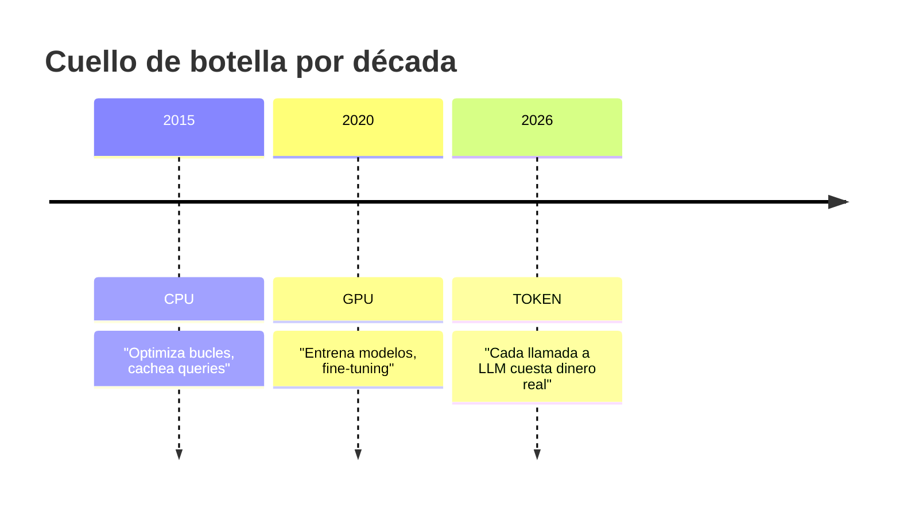
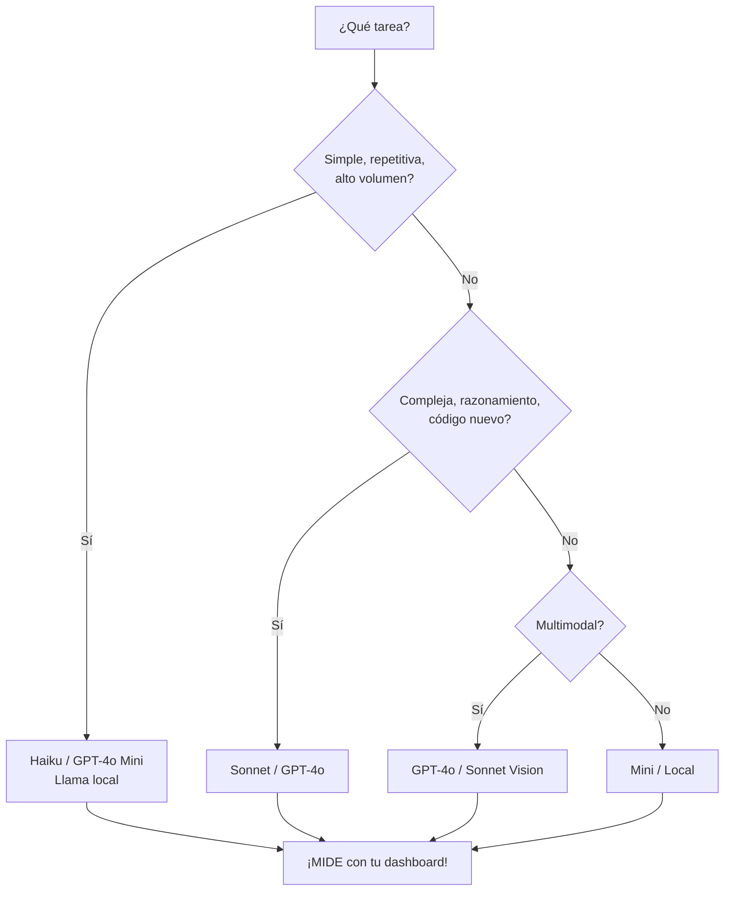
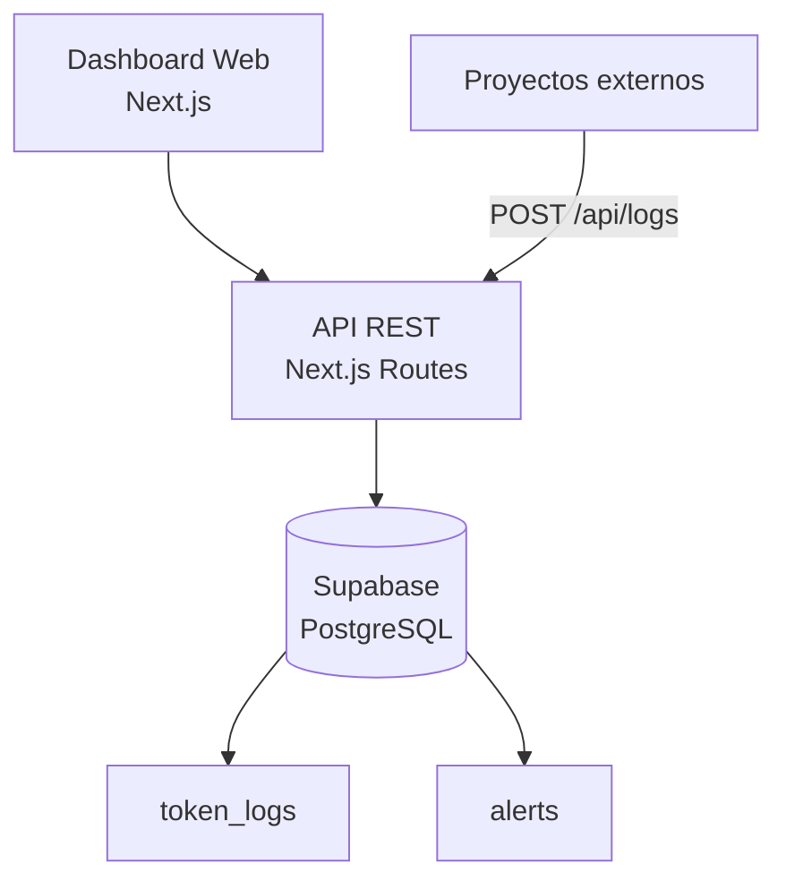

# Token Economy: Mide antes de Construir

## Módulo 1 · Sesión 1.1

### Curso AI Engineer — De Semi-Senior a Experto en IA

---

## 🎯 Objetivos de esta sesión

- Entender **por qué el token es la moneda del desarrollo en 2026**
- Dominar la **anatomía de un token**: input, output, caché
- **Comparar modelos** y elegir por ROI, no por marca
- Definir **5 métricas clave** para monitorear
- Conocer **herramientas gratuitas** existentes
- **Preview del Lab 1**: Tu dashboard de tokens (Web + API)

---

## 💡 El gancho: ¿Por qué esto importa?

> **"En 2024, un dev junior gastó $847 en una tarde con GPT-4.  
> En 2025, el mismo feature costó $12.  
> La diferencia: visibilidad de tokens."**

---

## 📈 Evolución del recurso escaso



---

## 🧬 Anatomía de un token

| Concepto | Realidad |
|----------|----------|
| **1 token** | ≠ 1 palabra |
| **Español** | ~1.5 caracteres / token |
| **Inglés** | ~0.75 palabras / token |
| **Código denso** | Más tokens por carácter |

> **Demo viva**: [platform.openai.com/tokenizer](https://platform.openai.com/tokenizer)

---

## 💰 Tres tipos de tokens, tres precios

| Tipo | Qué es | Costo relativo | Estrategia |
|------|--------|----------------|------------|
| **Input** | Tu prompt, contexto, archivos | 1x (base) | Compacta, reusa |
| **Output** | Respuesta del modelo | **3–5x** más caro | Limita longitud |
| **Cached** | Contexto reutilizado (prompt caching) | **~0.1x** o gratis | **Maximiza esto** |

> **Prompt Caching**: Mismo system prompt → paga 1 vez, usa 10 → **90% descuento**

---

## 🏷️ Comparativa de modelos 2026

| Modelo | Input / 1M | Output / 1M | Contexto | Ideal para |
|--------|------------|-------------|----------|------------|
| **Claude Sonnet 4** | $3.00 | $15.00 | 200K | Dev general, features complejas |
| **Claude Haiku 3.5** | $0.80 | $4.00 | 200K | Tareas rápidas, clasificación |
| **GPT-4o** | $2.50 | $10.00 | 128K | Multimodal, visión |
| **GPT-4o Mini** | $0.15 | $0.60 | 128K | Alto volumen, tareas simples |
| **Llama 3 70B (local)** | **$0** | **$0** | 128K | Privacidad total, costo cero |

---

## 🧮 Calculadora en vivo: 50 meta-descripciones SEO

```
Prompt: ~200 tokens
Respuesta: 50 × 100 tokens = 5,000 tokens output
```

| Modelo | Costo total | vs Mini |
|--------|-------------|---------|
| **Sonnet 4** | $0.0756 | 23x |
| **Haiku 3.5** | $0.0216 | 6.5x |
| **GPT-4o Mini** | **$0.0033** | 1x (base) |
| **Llama 3 local** | **$0.0000** | ∞ |

> **Regla de oro**: Usa el modelo más barato que resuelva tu tarea. Escala solo si falla.

---

## 🌳 Árbol de decisión: ¿Qué modelo elijo?



---

## 📊 Las 5 métricas que importan

### 1. Tokens por Request (P50, P95)
- **P95 > 2× promedio** → Outliers = investigación urgente

### 2. Costo por Tarea Completada
- No por token. **Por outcome**.
- "Crear CRUD: $0.45" → Presupuestable

### 3. Eficiencia de Prompt
- `Tokens útiles respuesta / Tokens totales gastados`
- **Objetivo: >20%**

### 4. Ratio de Caché
- `Tokens cacheados / Tokens totales input`
- **Objetivo: >60%** en flujos repetitivos

### 5. Costo por Deployment / Usuario / Proyecto
- Lo que tu CFO va a pedir. **Ten la respuesta lista**.

---

## 🛠️ Herramientas gratuitas hoy

| Herramienta | Qué hace | Free Tier | Ideal para |
|-------------|----------|-----------|------------|
| **Helicone** | Proxy + analytics automáticos | 100k req/mes | Empezar **ya**, sin código |
| **LangSmith** | Trazas completas de agentes | Generoso | Debugging agentes complejos |
| **OpenRouter** | 1 API = todos los modelos | Analytics incluidos | Probar modelos sin cambiar código |

> **¿Por qué construir el nuestro?** Aprendes, lo integras en TU stack, API reutilizable, propiedad total.

---

## 🚀 Lab 1: Dashboard de Tokens (Web + API)

### Stack
- **Next.js 15** (App Router) + **Tailwind CSS**
- **Supabase** (PostgreSQL + RLS)
- **Recharts** (gráficos React)
- **Vercel** (deploy gratis)

### Arquitectura



### Entregables
1. Dashboard con: gráfico diario, tabla logs, filtros, alertas
2. API: `POST /api/logs`, `GET /api/stats`, `POST /api/alerts`
3. Script de prueba que envía métricas simuladas
4. Deploy en Vercel + docs de API para reutilizar

---

## ✅ Checklist pre-Sesión 1.2

- [ ] Cuenta **GitHub** (gratis)
- [ ] Cuenta **Vercel** Hobby (gratis)
- [ ] Cuenta **Supabase** Free (gratis)
- [ ] Cuenta **Helicone** (gratis)
- [ ] **API Key Anthropic** (crédito inicial ~$5-10)
- [ ] **Node.js 20+**, **Git**, **VS Code**
- [ ] **Claude Code CLI** instalado
- [ ] Opcional: **Ollama** (`curl -fsSL https://ollama.ai/install.sh \| sh`)

---

## 📚 Recursos de esta sesión

| Recurso | Link |
|---------|------|
| Tokenizer OpenAI | `platform.openai.com/tokenizer` |
| Tokenizer Anthropic | `anthropic.com/token-counter` |
| Precios OpenAI | `openai.com/api/pricing` |
| Precios Anthropic | `anthropic.com/pricing` |
| Helicone | `helicone.ai` |
| LangSmith | `smith.langchain.com` |
| OpenRouter | `openrouter.ai` |
| Ollama | `ollama.ai` |

---

## 🎬 Próxima sesión: **Tu Primer Agente Productivo**

> Instalamos Claude Code, creamos un agente real,  
> y hacemos **Test A/B Haiku vs Sonnet** midiendo con **tu dashboard**.

**¡Nos vemos ahí!** 👋

---

*Curso AI Engineer — Módulo 1, Sesión 1.1*