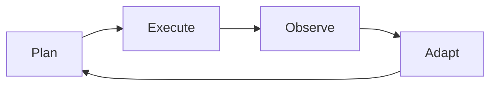
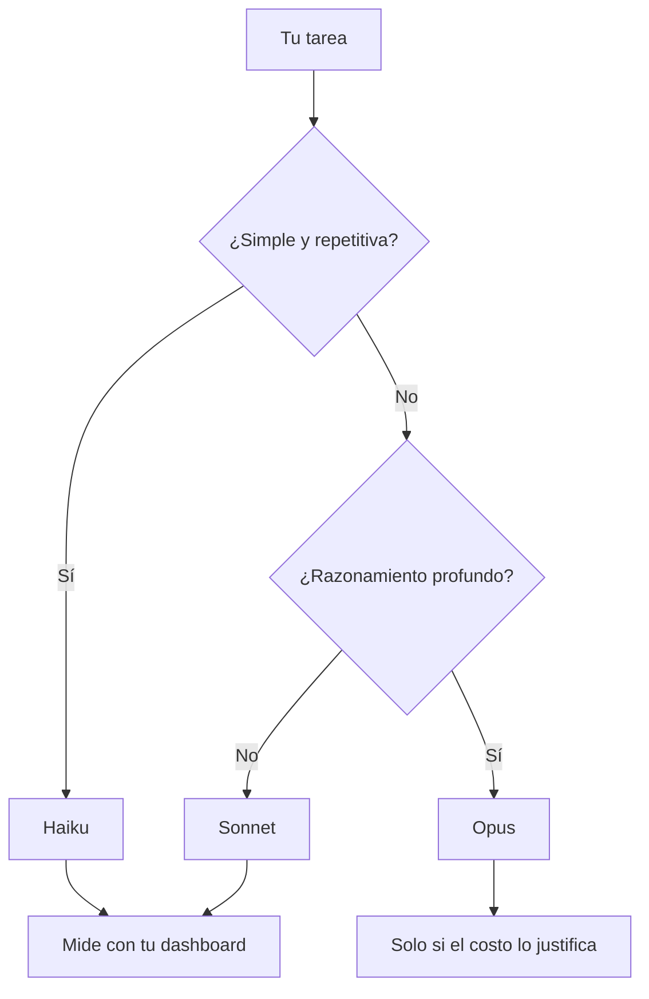

# Tu Primer Agente Productivo

## Módulo 1 · Sesión 1.2

### Curso AI Engineer — De Semi-Senior a Experto en IA

---

## 🎯 Objetivos de esta sesión

- Entender la **arquitectura de un agente de código**
- **Instalar y configurar Claude Code CLI**
- Saber **cuándo usar Haiku, Sonnet y Opus**
- Aplicar **control de costos** desde el inicio
- Ejecutar un **Test A/B real** entre modelos

---

## 🔄 El ciclo del agente



1. **Plan** — Analiza el request y decide herramientas
2. **Execute** — Ejecuta comandos, edita archivos
3. **Observe** — Lee resultados, errores, tests
4. **Adapt** — Ajusta el enfoque si algo falla

---

## 🧬 Anatomía de un agente

```
┌─────────────────────────────────────────┐
│             System Prompt                │
├─────────────────────────────────────────┤
│         Herramientas disponibles         │
├─────────────────────────────────────────┤
│              Contexto actual             │
├─────────────────────────────────────────┤
│                Output                    │
└─────────────────────────────────────────┘
```

---

## 🤖 Agente vs Chatbot

| Característica | Chatbot | Agente de código |
|----------------|---------|------------------|
| Output | Texto | Código + comandos |
| Herramientas | Ninguna | Bash, FS, Editor |
| Ciclo | Request → Response | Plan → Exec → Observe → Adapt |
| Contexto | Conversación | Archivos + proyecto |

---

## ⚙️ Claude Code CLI

```bash
# Instalación
npm install -g @anthropic-ai/claude-code

# Autenticación (primera vez)
claude
# → Te pide API key de console.anthropic.com

# Modo prompt (no interactivo)
claude -p "describe este código"

# Modo interactivo
claude
```

---

## 🚩 Flags útiles

```bash
# Especificar modelo
claude --model haiku
claude --model sonnet

# Límite de turns
claude --max-turns 10

# Modo verbose
claude --verbose

# Resumir sesión anterior
claude --resume
```

---

## 📦 @curso-ai/metrics

Paquete workspace del curso que **automatiza el reporte de métricas al dashboard**.

```bash
npm install @curso-ai/metrics
```

```typescript
import { trackAnthropic } from '@curso-ai/metrics'

const msg = await trackAnthropic(
  client.messages.create({ model: '...', messages }),
  { project: 'lab-2', dashboardUrl: URL }
)
// ✅ Extrae usage del response automáticamente
// ✅ Calcula costo según modelo
// ✅ Envía a POST /api/logs
// ✅ Retorna el mensaje original (transparente)
```

**Zero medición manual.**

---

## 🏷️ Los 3 modelos que usarás

| Modelo | Input/1M | Output/1M | Velocidad | Ideal para |
|--------|----------|-----------|-----------|------------|
| **Haiku 3.5** | $0.80 | $4.00 | ⚡ Rápido | Formateo, refactors, clasificación |
| **Sonnet 4** | $3.00 | $15.00 | 🚀 Balance | Features nuevas, dev general |
| **Opus 4** | $15.00 | $75.00 | 🐢 Lento | Razonamiento complejo, debugging |

---

## 🌳 Árbol de decisión de modelos



---

## 💵 Costo real por sesión típica

| Escenario | Modelo | Turns | Tokens | Costo |
|-----------|--------|-------|--------|-------|
| Refactor simple | Haiku | 2 | 5K | $0.02 |
| Crear componente | Sonnet | 8 | 40K | $0.55 |
| Debugging profundo | Opus | 15 | 150K | $7.50 |

> **Elegir el modelo correcto no es un lujo. Es una decisión financiera.**

---

## 🎛️ Palanca 1: Límite de Turns

```bash
# ✅ Siempre pon un límite
claude --max-turns 5

# ❌ Nunca dejes el default
claude  # turns ilimitados = $$$
```

> Un turno = ~2,000–5,000 tokens.  
> 20 turns sin límite = tarea simple de $1+ **en Haiku**.

---

## 🎛️ Palanca 2: Prompt Caching

- Claude cachea el system prompt y contexto inicial automáticamente
- **Clave**: Pon instrucciones al inicio, no las cambies
- Procesa tareas similares **en lote**, no una por una

> Reutilizar contexto = **hasta 90% de descuento** en tokens de input.

---

## 🎛️ Palanca 3: Batch de operaciones

```bash
# ❌ 10 llamadas separadas
claude -p "genera meta para página 1"
claude -p "genera meta para página 2"

# ✅ 1 llamada en lote
claude -p "genera meta para estas 10 páginas: ..."
```

> **Ahorro: 60–80% en costos de contexto.**

---

## 🔬 Demo: A/B Test Haiku vs Sonnet

### Escenario: 10 meta-descriptions SEO

```javascript
import { trackAnthropic } from '@curso-ai/metrics'

const haiku = await trackAnthropic(
  client.messages.create({ model: 'claude-haiku-3.5', messages }),
  { project: 'lab-2', dashboardUrl: URL, endpoint: '/ab-test/haiku' }
)

const sonnet = await trackAnthropic(
  client.messages.create({ model: 'claude-sonnet-4', messages }),
  { project: 'lab-2', dashboardUrl: URL, endpoint: '/ab-test/sonnet' }
)

// trackAnthropic() extrajo usage, calculó costo,
// envió al dashboard. Todo automático.
```

| Modelo | Tiempo | Costo | Calidad | Costo/punto |
|--------|--------|-------|---------|-------------|
| Haiku | 15s | $0.0048 | 3.5/5 | $0.0014 |
| Sonnet | 30s | $0.042 | 4.5/5 | $0.0093 |

---

## 📊 Conclusión del A/B Test

- **Haiku es 9x más barato** para esta tarea
- **8.75x más eficiente** en costo por punto de calidad
- Sonnet no justifica el **9x de costo adicional**

> **Para meta-descriptions SEO: Haiku es la opción correcta.**

---

## 🧪 Lab 2: Test A/B Haiku vs Sonnet

### Pasos
1. Instala `@anthropic-ai/sdk` + `@curso-ai/metrics`
2. Crea `run-ab-test.mjs` con `trackAnthropic()`
3. Ejecuta — métricas viajan solas al dashboard
4. Compara: costo, calidad, tiempo
5. Escribe tu conclusión

**Stack**: `@curso-ai/metrics` + Dashboard del Lab 1  
**Duración**: 2–3 horas  
**Requisito**: Lab 1 desplegado

---

## ✅ Checklist post-sesión

- [ ] Claude Code CLI instalado (`claude --version`)
- [ ] API key de Anthropic configurada
- [ ] Workspace configurado: `npm install` desde raíz del repo
- [ ] Lab 2 completado (A/B Test con `trackAnthropic()`)
- [ ] Dashboard muestra ambas ejecuciones con tokens reales
- [ ] Conclusión escrita: ¿cuándo usar Haiku vs Sonnet?

---

## 📚 Recursos

| Recurso | Link |
|---------|------|
| Claude Code Docs | `docs.anthropic.com/en/docs/claude-code` |
| Consola Anthropic | `console.anthropic.com` |
| Precios Anthropic | `anthropic.com/pricing` |
| Node.js | `nodejs.org` |

---

## 🎬 Próxima sesión: **Orquesta Múltiples Agentes**

> Vamos a orquestar agentes: uno planifica, otro escribe, otro revisa.  
> Crearemos el **andamiaje de TaskFlow AI** con Agent Manager.

**¡Nos vemos ahí!** 👋

---

*Curso AI Engineer — Módulo 1, Sesión 1.2*
