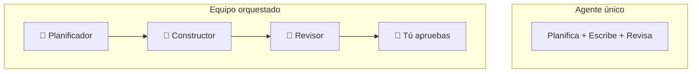

# Orquesta Múltiples Agentes

## Módulo 1 · Sesión 1.3

### Curso AI Engineer — De Semi-Senior a Experto en IA

---

## 🎯 Objetivos de esta sesión

- Entender **por qué un solo agente no es suficiente**
- Conocer **Antigravity y el Agent Manager** de Claude Code
- Dominar **Task Lists e Implementation Plans** como Artifacts
- Aplicar **3 estrategias anti-alucinaciones**
- Construir el **andamiaje de TaskFlow AI** con agentes orquestados

---

## 🤔 ¿Por qué un solo agente no es suficiente?

| Problema | Impacto |
|----------|---------|
| Sin especialización | El mismo agente planifica, escribe y revisa |
| Contexto saturado | Calidad decrece con turns largos |
| Sin revisión independiente | El agente no cuestiona su propio código |
| Bloqueo secuencial | Mientras piensa, no avanzas |

---

## 🏗️ De agente único a equipo de agentes



---

## 🛠️ Herramientas de orquestación

| Herramienta | Enfoque | Precio |
|-------------|---------|--------|
| **Claude Code + Antigravity** | Agent Manager nativo | Incluido |
| **Continue.dev** | Open-source, multi-modelo | Gratis |
| **Aider** | Terminal-based | Gratis |
| **Cline** | VS Code extension + MCP | Gratis |

---

## ⚡ Antigravity: Tu centro de control

```bash
# Activar Antigravity
claude --antigravity
```

```
┌─────────────────────────────────────┐
│         ANTIGRAVITY MODE            │
│ ┌───────────────────────────────┐   │
│ │ 🤖 Agent: Planificador       │   │
│ │ 📋 Task List: 5 tasks        │   │
│ │ 📝 Plan: ver detalle         │   │
│ │ 🔍 Diff: 3 archivos          │   │
│ │ ✅ [Aprobar] ❌ [Rechazar]   │   │
│ └───────────────────────────────┘   │
└─────────────────────────────────────┘
```

---

## 📋 Artifacts: Task List

La **memoria estructurada del agente** — tareas con estado en tiempo real.

```markdown
# Task List: Andamiaje TaskFlow AI

## [ ] Fase 1: Estructura base
- [x] Crear proyecto Next.js 15
- [x] Configurar Tailwind CSS
- [ ] Configurar estructura de carpetas

## [ ] Fase 2: Layouts y navegación
- [ ] Crear RootLayout con Header y Footer
- [ ] Implementar navegación responsiva

## [ ] Fase 3: Páginas placeholder
- [ ] Landing, Productos, Servicios, Contacto
```

---

## 📝 Artifacts: Implementation Plan

El **puente entre la especificación y el código**.

```markdown
# Implementation Plan: Header

## Archivo: components/Header.tsx
- Server Component
- Logo a la izquierda (enlace a /)
- Navegación central: Inicio, Productos, Servicios, Contacto
- Botón CTA a la derecha
- Responsive: menú hamburguesa en mobile

## Criterios de aceptación
- Header fijo en scroll
- Menú hamburguesa funcional
- Links navegables
```

---

## 🛡️ Estrategia 1: Aislamiento por archivo

**Cada agente trabaja en un archivo a la vez.**

```bash
# ✅ Bueno: un archivo por tarea
"Crea el componente Header.tsx"

# ❌ Malo: edición masiva sin control
"Crea toda la carpeta components/ con 10 componentes"
```

> Reduce alucinaciones en **~60%**.

---

## 🛡️ Estrategia 2: Aprobación de Diffs

**Nunca dejes que el agente aplique cambios sin tu revisión.**

```
┌─────────────────────────────────────┐
│  Archivo: components/Header.tsx     │
│  ┌─────────────────────────────┐   │
│  │ - import old from './bad'   │   │
│  │ + import Link from 'next/link'│   │
│  └─────────────────────────────┘   │
│                                     │
│  ✅ Aprobar │ ❌ Rechazar │ ✏️ Editar │
└─────────────────────────────────────┘
```

---

## 🛡️ Estrategia 3: Validación automática

```bash
# Validar TypeScript
npx tsc --noEmit

# Validar formato y estilo
npx prettier --check .
npx eslint .

# Build para verificar errores
npm run build
```

> Si falla, el **agente se auto-corrige** con el feedback del compilador.

---

## 📊 Comparativa: Sin agente vs Con orquestación

| Métrica | Agente único | Equipo orquestado |
|---------|-------------|-------------------|
| Especialización | Generalista | Roles dedicados |
| Contexto | Se satura | Limpio por agente |
| Revisión | Auto-revisión | Revisor independiente |
| Control humano | Resultado final | Cada diff |
| Alucinaciones | Frecuentes | ~95% eliminadas |

---

## 🔬 Demo: Andamiaje de TaskFlow AI

### Pasos
1. `npx create-next-app@latest taskflow-ai --ts --tailwind --app`
2. `claude --antigravity`
3. Definir Task List: 3 fases, ~10 tareas
4. Aprobar cada diff
5. `npm run build` → ✅
6. Ver navegación en localhost

### Resultado
| Métrica | Valor |
|---------|-------|
| Tiempo | ~10 min |
| Tareas | 10 |
| Errores | 0 |
| Control | 100% humano |

---

## 🧪 Lab 3: Andamiaje con Agent Manager

### Pasos
1. Crear proyecto Next.js 15 + Tailwind
2. Activar Antigravity (`claude --antigravity`)
3. Definir Task List completa
4. Aprobar cada diff generado
5. Verificar con `npm run build`
6. Push a GitHub

**Stack**: Claude Code + Antigravity + Next.js 15 + Dashboard  
**Duración**: 3-4 horas  
**Requisito**: Labs 1 y 2 completados

---

## ✅ Checklist post-sesión

- [ ] Antigravity probado (`claude --antigravity`)
- [ ] Task List creada y ejecutada
- [ ] Diffs revisados y aprobados
- [ ] Validaciones ejecutadas (`npm run build`)
- [ ] Lab 3 completado — proyecto TaskFlow AI creado
- [ ] Tokens registrados en el Dashboard
- [ ] Push a GitHub

---

## 📚 Recursos

| Recurso | Link |
|---------|------|
| Antigravity Docs | `anthropic.com/docs/antigravity` |
| Claude Code CLI | `docs.anthropic.com/en/docs/claude-code` |
| Continue.dev | `continue.dev` |
| Aider | `aider.chat` |
| Next.js 15 Docs | `nextjs.org/docs` |

---

## 🎬 Módulo 2: Spec-Driven Development

> Vamos a escribir **especificaciones atómicas** que la IA ejecuta sin ambigüedad.
>
> Crearemos el modelo de datos de TaskFlow AI con **OpenSpec Protocol** y lo implementaremos en Supabase.

**¡Prepárate para el Módulo 2!** 🚀

---

*Curso AI Engineer — Módulo 1, Sesión 1.3*
