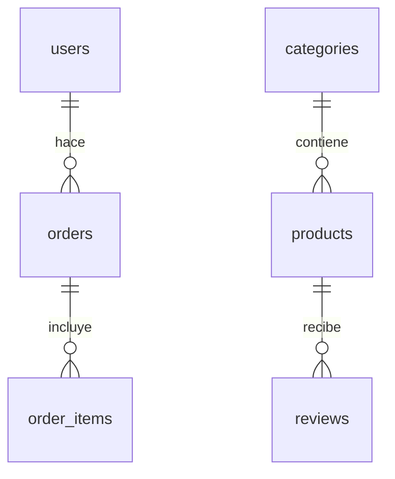
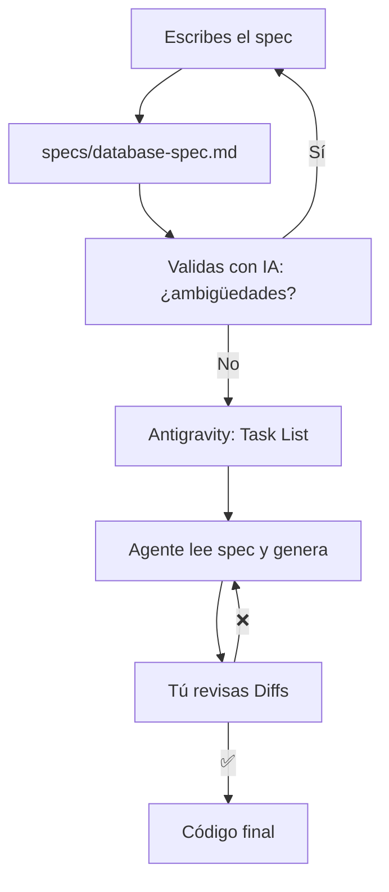

# SDD: El Contrato que Hace Predecible a tu Agente

## Módulo 2 · Sesión 2.1

### Curso AI Engineer — De Semi-Senior a Experto en IA

---

## 🎯 Objetivos de esta sesión

- Entender **por qué el prompt hacking no escala**
- Dominar **SDD** — Spec-Driven Development como metodología
- Conocer el **OpenSpec Protocol** y su anatomía
- **Eliminar ambigüedad** como un ingeniero
- Aprender a **inyectar specs en Claude Code**

---

## 🤕 El problema del prompt hacking

```
Tú:  "Crea una tabla de usuarios"
IA:  "✓ Tabla creada"
Tú:  "Pero yo quería que el email fuera único"
IA:  "✓ Corregido"
Tú:  "Y que el rol solo sea customer o admin"
IA:  "✓ Corregido"
Tú:  "Y que si se borra el usuario, los pedidos queden"
IA:  "✓ Corregido... pero ahora son 20 líneas de prompt"
```

**Cada iteración = más tokens, más contexto, menos calidad.**

---

## 📊 Los 3 dolores del prompt hacking

| Dolor | Qué pasa | Consecuencia |
|-------|----------|-------------|
| **Ambigüedad** | El agente adivina lo que no dijiste | Código que no es lo que necesitas |
| **Inconsistencia** | Cada llamada es independiente | IDs diferentes, estilos mezclados |
| **Rework infinito** | Repites instrucciones cada vez | +40% de tokens, -50% de calidad |

---

## 💰 El costo de la ambigüedad

| Métrica | Sin Spec | Con Spec | Ahorro |
|---------|----------|----------|--------|
| Tokens por feature | 40K | 24K | **40%** |
| Iteraciones de rework | 3-4 | 0-1 | **75%** |
| Errores en 1ra ejecución | ~60% | ~10% | **6x menos** |
| Tiempo de code review | 20 min | 5 min | **75%** |

> **Un buen spec no es un lujo. Es una decisión económica.**

---

## 📝 ¿Qué es SDD?

**Spec-Driven Development**: el spec es la **única fuente de verdad**.

```
Spec  →  Plan  →  Código  →  Tests  →  Documentación
 ↑                                                    │
 └────────────────────────────────────────────────────┘
                   (feedback loop)
```

1. **Spec** — Documento que define EXACTAMENTE qué necesitas
2. **Plan** — El agente desglosa el spec en tareas
3. **Código** — Cada línea está justificada por el spec
4. **Tests** — Validan los criterios de aceptación
5. **Documentación** — El spec ES la documentación

---

## 📄 Spec vs Prompt

| Aspecto | Prompt | Spec |
|---------|--------|------|
| Formato | Conversación | Documento estructurado |
| Reutilizable | No | Sí (vive en el repo) |
| Precisión | "hazlo bonito" | "color #1e3a5f" |
| Versionable | No | Sí (git) |
| Role | Pedido verbal | Contrato ejecutable |

> Un prompt es un WhatsApp. Un spec es un contrato firmado.

---

## 📁 El spec vive en el repo

```
taskflow-ai/
├── specs/
│   ├── database-spec.md      ← Modelo de datos
│   └── api-spec.md           ← API endpoints
├── app/
├── components/
└── ...
```

**Ventajas**:
- 📌 Versionado con git
- 👥 Todo el equipo lo lee
- 🤖 El agente siempre accede a la última versión
- 🔄 Si cambia algo, cambias el spec, no el código

---

## 🧬 OpenSpec Protocol

Formato estándar para specs que el agente entiende sin esfuerzo.

```
┌─────────────────────────────────────┐
│ 1. Metadata                         │
│    Título, versión, autor, fecha    │
├─────────────────────────────────────┤
│ 2. Contexto                         │
│    Propósito, alcance, stack        │
├─────────────────────────────────────┤
│ 3. Definición de datos              │
│    Entidades, campos, tipos, relac. │
├─────────────────────────────────────┤
│ 4. Reglas de negocio                │
│    Validaciones, lógica             │
├─────────────────────────────────────┤
│ 5. Seguridad (RLS)                  │
│    Políticas de acceso              │
├─────────────────────────────────────┤
│ 6. Criterios de aceptación          │
│    ¿Cuándo el spec está listo?     │
└─────────────────────────────────────┘
```

---

## 1. Metadata — ¿Quién? ¿Cuándo? ¿Versión?

```markdown
# OpenSpec — Modelo de Datos de TaskFlow AI

**Versión**: 1.0
**Autor**: Curso AI Engineer
**Fecha**: Julio 2026
**Estado**: Validado
```

Simple. **Trackeable con git.** Siempre sabes si estás viendo la versión correcta.

---

## 2. Contexto — ¿Qué? ¿Por qué? ¿Con qué?

```markdown
## 1. Contexto
### 1.1 Propósito
Plataforma de servicios técnicos donde usuarios
navegan productos, agregan al carrito y compran.

### 1.2 Stack destino
- BD: Supabase (PostgreSQL 15+)
- Extensión: pgvector (Módulo 4)
- Auth: Supabase Auth
```

> El agente necesita saber **qué estás construyendo** y **en qué tecnología**.

---

## 3. Datos — El corazón del spec

```sql
CREATE TABLE products (
  id UUID PRIMARY KEY DEFAULT gen_random_uuid(),
  name TEXT NOT NULL,
  slug TEXT NOT NULL UNIQUE,
  price DECIMAL(10,2) NOT NULL CHECK (price >= 0),
  stock_quantity INTEGER NOT NULL DEFAULT 0
);
```

| Campo | Tipo | Constraints | Descripción |
|-------|------|-------------|-------------|
| id | UUID | PK | ID único |
| name | TEXT | NOT NULL | Nombre visible |
| slug | TEXT | NOT NULL, UNIQUE | URL amigable |
| price | DECIMAL(10,2) | NOT NULL, CHECK >= 0 | Precio de venta |

**Tipos explícitos. Constraints visibles. Sin ambigüedad.**

---

## 🔗 Relaciones entre entidades



> Un diagrama vale más que mil palabras de prompt.

---

## 4. Reglas de negocio — Lo que no se ve en el schema

```markdown
**Reglas de negocio de products**:
- No se elimina una categoría si tiene productos (RESTRICT)
- compare_at_price debe ser > price
- stock = 0 → producto "Agotado"
- SKU único global
```

> **Si no está en el spec, el agente no lo sabe. Y va a inventar.**

---

## 5. Seguridad (RLS) — ¿Quién puede hacer qué?

```sql
-- Usuarios solo ven su propio carrito
CREATE POLICY "cart_items_read_own" ON cart_items
  FOR SELECT USING (auth.uid() = user_id);

-- Solo admins modifican productos
CREATE POLICY "products_admin_all" ON products
  FOR ALL USING (auth.jwt() ->> 'role' = 'admin');
```

> **Esto es lo que más se olvida con prompt hacking.**
> En SDD, la seguridad está en el spec desde el día 1.

---

## 6. Criterios de aceptación — ¿Está listo?

```markdown
- [ ] 7 entidades definidas con campos y tipos
- [ ] Todas las relaciones documentadas
- [ ] Reglas de negocio sin ambigüedad
- [ ] RLS definido para cada tabla
- [ ] IA confirma: "sin ambigüedades"
```

> **Sin criterios de aceptación, el spec nunca termina.**

---

## 🎯 4 técnicas para eliminar ambigüedad

### 1. Tipos explícitos
```
❌ "Un campo para el precio"
✅ price DECIMAL(10,2) NOT NULL CHECK (price >= 0)
```

### 2. Ejemplos concretos
```
❌ "Nombre del producto"
✅ name TEXT NOT NULL — Ej: "MacBook Pro M4 32GB"
```

---

## 🎯 4 técnicas para eliminar ambigüedad (cont.)

### 3. Constraints visibles

| Ambigüo | Preciso |
|---------|---------|
| "El usuario tiene un carrito" | UNIQUE(user_id, product_id) |
| "Los precios se guardan" | unit_price al momento de la compra |
| "Los admins tienen permisos" | RLS: admin ALL en todas las tablas |

### 4. Validación con IA
```bash
claude -p "Lee este spec y dime qué ambigüedades encuentras"
```

> **Si el agente encuentra ambigüedades, el spec no está listo.**

---

## 💻 3 formas de inyectar el spec en Claude Code

### Forma 1 — Por archivo (recomendada)
```bash
claude -p "Lee specs/database-spec.md y genera migraciones SQL"
```

### Forma 2 — Task List en Antigravity
```
"Implementar el modelo de datos del spec specs/database-spec.md"
```

### Forma 3 — Copia directa (para tareas pequeñas)
```bash
claude -p "Según el spec: [sección específica] ..."
```

---

## 🔄 Flujo SDD recomendado



---

## 🔬 Demo: Spec desde cero (10 min)

### Pasos
1. `mkdir specs && touch specs/database-spec.md`
2. Escribir metadata + contexto
3. Definir entidades: users, categories, products, cart_items, orders, order_items, reviews
4. Agregar reglas de negocio
5. Escribir políticas RLS
6. Validar con Claude
7. Refinar hasta "sin ambigüedades"

### Resultado
| Paso | Tiempo |
|------|--------|
| Escribir spec | ~15 min |
| Validar con IA | ~2 min |
| Refinar | ~3 min |
| **Total** | **~20 min** |

---

## 🧪 Lab 4: Spec Atómico para TaskFlow AI

### Pasos
1. Crear `specs/database-spec.md` con OpenSpec Protocol
2. Definir 7 entidades: campos, tipos, constraints, relaciones
3. Documentar reglas de negocio
4. Escribir políticas RLS
5. Validar con Claude — refinar hasta "sin ambigüedades"
6. Commit: `git add specs/ && git commit -m "feat: database spec"`

**Stack**: Markdown + Claude Code + Dashboard
**Duración**: 3-4 horas | **Tokens**: ~15K-30K
**Requisito**: Proyecto TaskFlow AI del Lab 3

---

## ✅ Checklist post-sesión

- [ ] Carpeta `specs/` creada en la raíz del proyecto
- [ ] `database-spec.md` con las 7 entidades
- [ ] Tipos explícitos para cada campo
- [ ] Reglas de negocio documentadas
- [ ] Políticas RLS definidas
- [ ] Spec validado por IA: "sin ambigüedades"
- [ ] Commit subido a GitHub

---

## 📚 Recursos

| Recurso | Link |
|---------|------|
| OpenSpec Protocol | `specs/database-spec.md` |
| Claude Code Docs | `docs.anthropic.com/en/docs/claude-code` |
| Supabase Docs | `supabase.com/docs` |
| PostgreSQL Docs | `postgresql.org/docs` |
| Repo del curso | `github.com/tu-usuario/curso-ai-engineer` |

---

## 🎬 Sesión 2.2: Backend en Supabase

> El agente lee tu spec y genera migraciones SQL, RLS y seed data.
>
> **De spec a base de datos funcional en minutos.**

**¡Nos vemos en la Sesión 2.2!** 🚀

---

*Curso AI Engineer — Módulo 2, Sesión 2.1*
