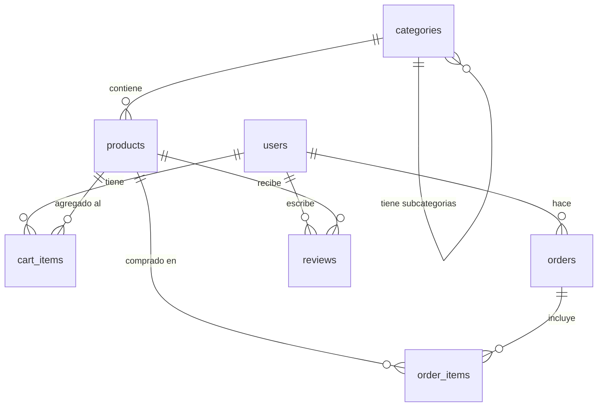

# OpenSpec — Modelo de Datos de TaskFlow AI

**Versión**: 1.0
**Autor**: Curso AI Engineer
**Fecha**: Julio 2026
**Estado**: Validado

---

## 1. Contexto

### 1.1 Propósito

Este spec define el modelo de datos completo de **TaskFlow AI**, una plataforma web de servicios técnicos donde los usuarios pueden:
- Navegar por un catálogo de productos y servicios
- Agregar items a un carrito de compras
- Realizar pedidos y revisar su historial
- Dejar reseñas sobre productos comprados

### 1.2 Alcance

Cubre 7 entidades: `users`, `categories`, `products`, `cart_items`, `orders`, `order_items`, `reviews`.

No cubre: autenticación (se maneja con Supabase Auth), facturación externa, ni webhooks.

### 1.3 Stack destino

- **Base de datos**: Supabase (PostgreSQL 15+)
- **Extensión**: pgvector (para Módulo 4 — embeddings)
- **Auth**: Supabase Auth (integración nativa con RLS)
- **ORM**: No se usa ORM — consultas directas con Supabase SDK

---

## 2. Definición de Datos

### 2.1 Convenciones generales

- **Timestamps**: usamos `created_at` y `updated_at` en todas las tablas
- **IDs**: UUID v4 generados por la BD (`gen_random_uuid()`)
- **Soft delete**: `deleted_at TIMESTAMPTZ` nullable en lugar de DELETE físico
- **Idioma**: nombres de columnas en inglés, comentarios en español

### 2.2 Entidad: `users`

Tabla gestionada por Supabase Auth. Se extiende con una tabla `public.users`.

```sql
CREATE TABLE public.users (
  id UUID PRIMARY KEY REFERENCES auth.users(id) ON DELETE CASCADE,
  full_name TEXT NOT NULL,
  avatar_url TEXT,
  role TEXT NOT NULL DEFAULT 'customer' CHECK (role IN ('customer', 'admin')),
  created_at TIMESTAMPTZ NOT NULL DEFAULT now(),
  updated_at TIMESTAMPTZ NOT NULL DEFAULT now(),
  deleted_at TIMESTAMPTZ
);
```

**Campos**:

| Campo | Tipo | Constraints | Descripción |
|-------|------|------------|-------------|
| id | UUID | PK, FK → auth.users | ID del usuario (lo crea Supabase Auth) |
| full_name | TEXT | NOT NULL | Nombre completo del usuario |
| avatar_url | TEXT | nullable | URL del avatar (desde Supabase Storage) |
| role | TEXT | NOT NULL, DEFAULT 'customer', CHECK (customer, admin) | Rol del usuario |
| created_at | TIMESTAMPTZ | NOT NULL, DEFAULT now() | Fecha de registro |
| updated_at | TIMESTAMPTZ | NOT NULL, DEFAULT now() | Última actualización |
| deleted_at | TIMESTAMPTZ | nullable | Fecha de baja (soft delete) |

**Reglas de negocio**:
- Solo el propio usuario o un admin puede modificar `full_name` y `avatar_url`
- El campo `role` solo puede ser modificado por un admin
- Al eliminar un usuario (soft delete), sus pedidos históricos se conservan

### 2.3 Entidad: `categories`

```sql
CREATE TABLE public.categories (
  id UUID PRIMARY KEY DEFAULT gen_random_uuid(),
  name TEXT NOT NULL,
  slug TEXT NOT NULL UNIQUE,
  description TEXT,
  image_url TEXT,
  parent_id UUID REFERENCES public.categories(id) ON DELETE SET NULL,
  sort_order INTEGER NOT NULL DEFAULT 0,
  is_active BOOLEAN NOT NULL DEFAULT true,
  created_at TIMESTAMPTZ NOT NULL DEFAULT now(),
  updated_at TIMESTAMPTZ NOT NULL DEFAULT now(),
  deleted_at TIMESTAMPTZ
);

CREATE UNIQUE INDEX idx_categories_slug ON public.categories(slug) WHERE deleted_at IS NULL;
```

**Campos**:

| Campo | Tipo | Constraints | Descripción |
|-------|------|------------|-------------|
| id | UUID | PK, DEFAULT gen_random_uuid() | ID único |
| name | TEXT | NOT NULL | Nombre visible (ej: "Laptops") |
| slug | TEXT | NOT NULL, UNIQUE | Slug para URL (ej: "laptops") |
| description | TEXT | nullable | Descripción de la categoría |
| image_url | TEXT | nullable | Imagen representativa |
| parent_id | UUID | FK → categories, ON DELETE SET NULL | Categoría padre (para subcategorías) |
| sort_order | INTEGER | NOT NULL, DEFAULT 0 | Orden de visualización |
| is_active | BOOLEAN | NOT NULL, DEFAULT true | Si está visible en la web |
| created_at | TIMESTAMPTZ | NOT NULL, DEFAULT now() | |
| updated_at | TIMESTAMPTZ | NOT NULL, DEFAULT now() | |
| deleted_at | TIMESTAMPTZ | nullable | |

**Reglas de negocio**:
- Un slug no puede repetirse entre categorías activas
- Una categoría puede tener un padre (subcategoría) o ser raíz (parent_id IS NULL)
- No puede haber más de 3 niveles de profundidad (raíz → sub → sub-sub)
- Al desactivar una categoría (`is_active = false`), sus productos no deben mostrarse en la web (responsabilidad del frontend)

### 2.4 Entidad: `products`

```sql
CREATE TABLE public.products (
  id UUID PRIMARY KEY DEFAULT gen_random_uuid(),
  category_id UUID NOT NULL REFERENCES public.categories(id) ON DELETE RESTRICT,
  name TEXT NOT NULL,
  slug TEXT NOT NULL UNIQUE,
  description TEXT NOT NULL,
  short_description TEXT,
  price DECIMAL(10,2) NOT NULL CHECK (price >= 0),
  compare_at_price DECIMAL(10,2) CHECK (compare_at_price >= 0),
  cost_price DECIMAL(10,2) CHECK (cost_price >= 0),
  sku TEXT UNIQUE,
  stock_quantity INTEGER NOT NULL DEFAULT 0 CHECK (stock_quantity >= 0),
  is_active BOOLEAN NOT NULL DEFAULT true,
  is_featured BOOLEAN NOT NULL DEFAULT false,
  images TEXT[] DEFAULT '{}',
  metadata JSONB DEFAULT '{}',
  embedding VECTOR(1536),
  created_at TIMESTAMPTZ NOT NULL DEFAULT now(),
  updated_at TIMESTAMPTZ NOT NULL DEFAULT now(),
  deleted_at TIMESTAMPTZ
);

CREATE UNIQUE INDEX idx_products_slug ON public.products(slug) WHERE deleted_at IS NULL;
CREATE INDEX idx_products_category ON public.products(category_id) WHERE deleted_at IS NULL;
CREATE INDEX idx_products_active ON public.products(is_active) WHERE deleted_at IS NULL;
```

**Campos**:

| Campo | Tipo | Constraints | Descripción |
|-------|------|------------|-------------|
| id | UUID | PK | ID único |
| category_id | UUID | FK → categories, ON DELETE RESTRICT | Categoría del producto |
| name | TEXT | NOT NULL | Nombre del producto |
| slug | TEXT | NOT NULL, UNIQUE | Slug para URL |
| description | TEXT | NOT NULL | Descripción completa (HTML permitido) |
| short_description | TEXT | nullable | Resumen para tarjetas |
| price | DECIMAL(10,2) | NOT NULL, CHECK >= 0 | Precio de venta |
| compare_at_price | DECIMAL(10,2) | nullable, CHECK >= 0 | Precio tachado (si está en oferta) |
| cost_price | DECIMAL(10,2) | nullable, CHECK >= 0 | Precio de costo (solo admin ve) |
| sku | TEXT | UNIQUE | Código SKU del producto |
| stock_quantity | INTEGER | NOT NULL, DEFAULT 0, CHECK >= 0 | Stock disponible |
| is_active | BOOLEAN | NOT NULL, DEFAULT true | Visible en tienda |
| is_featured | BOOLEAN | NOT NULL, DEFAULT false | Destacado en landing |
| images | TEXT[] | DEFAULT '{}' | Array de URLs de imágenes |
| metadata | JSONB | DEFAULT '{}' | Metadatos flexibles (peso, dimensiones, etc.) |
| embedding | VECTOR(1536) | nullable | Embedding para búsqueda semántica (Módulo 4) |
| created_at | TIMESTAMPTZ | NOT NULL, DEFAULT now() | |
| updated_at | TIMESTAMPTZ | NOT NULL, DEFAULT now() | |
| deleted_at | TIMESTAMPTZ | nullable | |

**Reglas de negocio**:
- No se puede eliminar una categoría si tiene productos asociados (ON DELETE RESTRICT)
- `price` debe ser 0 o mayor
- Si `compare_at_price` tiene valor, debe ser mayor que `price`
- Si `stock_quantity` es 0, el producto se muestra como "Agotado" (frontend)
- `sku` es único a nivel global

### 2.5 Entidad: `cart_items`

```sql
CREATE TABLE public.cart_items (
  id UUID PRIMARY KEY DEFAULT gen_random_uuid(),
  user_id UUID NOT NULL REFERENCES public.users(id) ON DELETE CASCADE,
  product_id UUID NOT NULL REFERENCES public.products(id) ON DELETE CASCADE,
  quantity INTEGER NOT NULL CHECK (quantity > 0),
  created_at TIMESTAMPTZ NOT NULL DEFAULT now(),
  updated_at TIMESTAMPTZ NOT NULL DEFAULT now(),
  UNIQUE(user_id, product_id)
);
```

**Campos**:

| Campo | Tipo | Constraints | Descripción |
|-------|------|------------|-------------|
| id | UUID | PK | ID único |
| user_id | UUID | FK → users, ON DELETE CASCADE | Dueño del carrito |
| product_id | UUID | FK → products, ON DELETE CASCADE | Producto agregado |
| quantity | INTEGER | NOT NULL, CHECK > 0 | Cantidad |
| created_at | TIMESTAMPTZ | NOT NULL, DEFAULT now() | |
| updated_at | TIMESTAMPTZ | NOT NULL, DEFAULT now() | |

**Reglas de negocio**:
- Un usuario no puede tener dos `cart_items` para el mismo producto (UNIQUE user_id, product_id)
- Si se repite el mismo producto, se incrementa la cantidad
- Al eliminar un producto, todos los cart_items de ese producto se eliminan (CASCADE)
- `quantity` no puede exceder `stock_quantity` del producto (validar en API)
- No hay sesión de invitado — solo usuarios autenticados tienen carrito

### 2.6 Entidad: `orders`

```sql
CREATE TYPE order_status AS ENUM (
  'pending', 'confirmed', 'processing', 'shipped',
  'delivered', 'cancelled', 'refunded'
);

CREATE TABLE public.orders (
  id UUID PRIMARY KEY DEFAULT gen_random_uuid(),
  user_id UUID NOT NULL REFERENCES public.users(id) ON DELETE RESTRICT,
  status order_status NOT NULL DEFAULT 'pending',
  total_amount DECIMAL(10,2) NOT NULL CHECK (total_amount >= 0),
  shipping_address TEXT NOT NULL,
  billing_address TEXT NOT NULL,
  notes TEXT,
  paid_at TIMESTAMPTZ,
  shipped_at TIMESTAMPTZ,
  delivered_at TIMESTAMPTZ,
  cancelled_at TIMESTAMPTZ,
  created_at TIMESTAMPTZ NOT NULL DEFAULT now(),
  updated_at TIMESTAMPTZ NOT NULL DEFAULT now(),
  deleted_at TIMESTAMPTZ
);

CREATE INDEX idx_orders_user ON public.orders(user_id);
CREATE INDEX idx_orders_status ON public.orders(status);
```

**Campos**:

| Campo | Tipo | Constraints | Descripción |
|-------|------|------------|-------------|
| id | UUID | PK | ID único |
| user_id | UUID | FK → users, ON DELETE RESTRICT | Comprador |
| status | order_status | NOT NULL, DEFAULT 'pending' | Estado del pedido |
| total_amount | DECIMAL(10,2) | NOT NULL, CHECK >= 0 | Total calculado |
| shipping_address | TEXT | NOT NULL | Dirección de envío |
| billing_address | TEXT | NOT NULL | Dirección de facturación |
| notes | TEXT | nullable | Notas del cliente |
| paid_at | TIMESTAMPTZ | nullable | Fecha de pago |
| shipped_at | TIMESTAMPTZ | nullable | Fecha de envío |
| delivered_at | TIMESTAMPTZ | nullable | Fecha de entrega |
| cancelled_at | TIMESTAMPTZ | nullable | Fecha de cancelación |
| created_at | TIMESTAMPTZ | NOT NULL, DEFAULT now() | |
| updated_at | TIMESTAMPTZ | NOT NULL, DEFAULT now() | |
| deleted_at | TIMESTAMPTZ | nullable | |

**Reglas de negocio**:
- No se puede eliminar un usuario si tiene pedidos (ON DELETE RESTRICT)
- El `total_amount` se calcula como suma de `order_items.quantity * order_items.unit_price`
- Estados válidos: pending → confirmed → processing → shipped → delivered
- Desde cualquier estado se puede ir a `cancelled` o `refunded`
- Al cancelar un pedido, se debe restaurar el stock (responsabilidad de la API)
- `paid_at` se setea cuando el pago es confirmado

### 2.7 Entidad: `order_items`

```sql
CREATE TABLE public.order_items (
  id UUID PRIMARY KEY DEFAULT gen_random_uuid(),
  order_id UUID NOT NULL REFERENCES public.orders(id) ON DELETE CASCADE,
  product_id UUID NOT NULL REFERENCES public.products(id) ON DELETE RESTRICT,
  quantity INTEGER NOT NULL CHECK (quantity > 0),
  unit_price DECIMAL(10,2) NOT NULL CHECK (unit_price >= 0),
  total_price DECIMAL(10,2) NOT NULL CHECK (total_price >= 0),
  created_at TIMESTAMPTZ NOT NULL DEFAULT now()
);

CREATE INDEX idx_order_items_order ON public.order_items(order_id);
```

**Campos**:

| Campo | Tipo | Constraints | Descripción |
|-------|------|------------|-------------|
| id | UUID | PK | ID único |
| order_id | UUID | FK → orders, ON DELETE CASCADE | Pedido al que pertenece |
| product_id | UUID | FK → products, ON DELETE RESTRICT | Producto comprado |
| quantity | INTEGER | NOT NULL, CHECK > 0 | Cantidad comprada |
| unit_price | DECIMAL(10,2) | NOT NULL, CHECK >= 0 | Precio unitario al momento de la compra |
| total_price | DECIMAL(10,2) | NOT NULL, CHECK >= 0 | quantity * unit_price |
| created_at | TIMESTAMPTZ | NOT NULL, DEFAULT now() | |

**Reglas de negocio**:
- `unit_price` guarda el precio del producto al momento de la compra (no se actualiza si el precio cambia después)
- `total_price` debe ser igual a `quantity * unit_price`
- Si se elimina un pedido, todos sus items se eliminan (CASCADE)
- No se puede eliminar un producto si existe en un order_item (RESTRICT)

### 2.8 Entidad: `reviews`

```sql
CREATE TABLE public.reviews (
  id UUID PRIMARY KEY DEFAULT gen_random_uuid(),
  product_id UUID NOT NULL REFERENCES public.products(id) ON DELETE CASCADE,
  user_id UUID NOT NULL REFERENCES public.users(id) ON DELETE CASCADE,
  rating INTEGER NOT NULL CHECK (rating >= 1 AND rating <= 5),
  title TEXT,
  content TEXT,
  is_verified_purchase BOOLEAN NOT NULL DEFAULT false,
  is_approved BOOLEAN NOT NULL DEFAULT true,
  created_at TIMESTAMPTZ NOT NULL DEFAULT now(),
  updated_at TIMESTAMPTZ NOT NULL DEFAULT now(),
  deleted_at TIMESTAMPTZ,
  UNIQUE(product_id, user_id)
);

CREATE INDEX idx_reviews_product ON public.reviews(product_id) WHERE deleted_at IS NULL;
```

**Campos**:

| Campo | Tipo | Constraints | Descripción |
|-------|------|------------|-------------|
| id | UUID | PK | ID único |
| product_id | UUID | FK → products, ON DELETE CASCADE | Producto reseñado |
| user_id | UUID | FK → users, ON DELETE CASCADE | Autor de la reseña |
| rating | INTEGER | NOT NULL, CHECK 1-5 | Puntuación (1-5 estrellas) |
| title | TEXT | nullable | Título de la reseña |
| content | TEXT | nullable | Contenido de la reseña |
| is_verified_purchase | BOOLEAN | NOT NULL, DEFAULT false | Si el usuario compró el producto |
| is_approved | BOOLEAN | NOT NULL, DEFAULT true | Aprobada por admin (moderación) |
| created_at | TIMESTAMPTZ | NOT NULL, DEFAULT now() | |
| updated_at | TIMESTAMPTZ | NOT NULL, DEFAULT now() | |
| deleted_at | TIMESTAMPTZ | nullable | |

**Reglas de negocio**:
- Un usuario solo puede dejar una reseña por producto (UNIQUE product_id, user_id)
- `rating` debe ser entre 1 y 5 (inclusive)
- `is_verified_purchase` se setea automáticamente si el usuario tiene un order_item completado para ese producto
- Las reseñas no aprobadas no se muestran en la web

---

## 3. Relaciones entre entidades



---

## 4. Reglas de Negocio General

### 4.1 Carrito
- El carrito es por usuario autenticado. No hay carrito de invitados.
- Al hacer checkout, el carrito se convierte en un pedido y se vacía.
- Si un producto se desactiva, se elimina del carrito (frontend + API).

### 4.2 Pedidos
- El `total_amount` se calcula en la API al crear el pedido.
- El stock se descuenta al confirmar el pedido.
- Si se cancela, el stock se restaura.
- El historial de pedidos es visible para el usuario y para los admins.

### 4.3 Reseñas
- Solo se puede reseñar un producto si se ha comprado (verificado por `is_verified_purchase`).
- Las reseñas se muestran ordenadas por fecha descendente.
- El promedio de rating se calcula en consulta (no hay campo materializado).

### 4.4 Catálogo
- Productos inactivos no aparecen en la web pero se mantienen en BD.
- Categorías inactivas ocultan sus productos (frontend).

---

## 5. Seguridad (RLS — Row Level Security)

Todas las tablas tienen RLS habilitado en Supabase.

### 5.1 `users`

```sql
-- Los usuarios pueden leer su propio perfil
CREATE POLICY "users_read_own" ON public.users
  FOR SELECT USING (auth.uid() = id);

-- Los admins pueden leer todos los perfiles
CREATE POLICY "users_read_admin" ON public.users
  FOR SELECT USING (auth.jwt() ->> 'role' = 'admin');

-- Cada usuario puede actualizar su propio perfil (excepto role)
CREATE POLICY "users_update_own" ON public.users
  FOR UPDATE USING (auth.uid() = id)
  WITH CHECK (auth.uid() = id);
```

### 5.2 `categories`

```sql
-- Cualquiera puede leer categorías activas
CREATE POLICY "categories_read_active" ON public.categories
  FOR SELECT USING (is_active = true AND deleted_at IS NULL);

-- Solo admins pueden modificar
CREATE POLICY "categories_admin_all" ON public.categories
  FOR ALL USING (auth.jwt() ->> 'role' = 'admin');
```

### 5.3 `products`

```sql
-- Cualquiera puede leer productos activos
CREATE POLICY "products_read_active" ON public.products
  FOR SELECT USING (is_active = true AND deleted_at IS NULL);

-- Solo admins pueden modificar
CREATE POLICY "products_admin_all" ON public.products
  FOR ALL USING (auth.jwt() ->> 'role' = 'admin');
```

### 5.4 `cart_items`

```sql
-- Los usuarios solo ven su propio carrito
CREATE POLICY "cart_items_read_own" ON public.cart_items
  FOR SELECT USING (auth.uid() = user_id);

-- Los usuarios solo modifican su propio carrito
CREATE POLICY "cart_items_manage_own" ON public.cart_items
  FOR INSERT WITH CHECK (auth.uid() = user_id);

CREATE POLICY "cart_items_update_own" ON public.cart_items
  FOR UPDATE USING (auth.uid() = user_id);

CREATE POLICY "cart_items_delete_own" ON public.cart_items
  FOR DELETE USING (auth.uid() = user_id);
```

### 5.5 `orders`

```sql
-- Usuarios ven sus propios pedidos
CREATE POLICY "orders_read_own" ON public.orders
  FOR SELECT USING (auth.uid() = user_id);

-- Admins ven todos
CREATE POLICY "orders_read_admin" ON public.orders
  FOR SELECT USING (auth.jwt() ->> 'role' = 'admin');

-- Usuarios crean sus propios pedidos
CREATE POLICY "orders_insert_own" ON public.orders
  FOR INSERT WITH CHECK (auth.uid() = user_id);

-- Solo admins actualizan estados
CREATE POLICY "orders_admin_update" ON public.orders
  FOR UPDATE USING (auth.jwt() ->> 'role' = 'admin');
```

### 5.6 `order_items`

```sql
-- Usuarios ven items de sus pedidos
CREATE POLICY "order_items_read_own" ON public.order_items
  FOR SELECT USING (
    EXISTS (
      SELECT 1 FROM public.orders
      WHERE orders.id = order_items.order_id
      AND orders.user_id = auth.uid()
    )
  );

-- Admins ven todos
CREATE POLICY "order_items_read_admin" ON public.order_items
  FOR SELECT USING (auth.jwt() ->> 'role' = 'admin');

-- Solo admins insertan/actualizan
CREATE POLICY "order_items_admin_insert" ON public.order_items
  FOR INSERT WITH CHECK (auth.jwt() ->> 'role' = 'admin');
```

### 5.7 `reviews`

```sql
-- Cualquiera puede leer reseñas aprobadas
CREATE POLICY "reviews_read_approved" ON public.reviews
  FOR SELECT USING (is_approved = true AND deleted_at IS NULL);

-- Usuarios autenticados crean sus reseñas
CREATE POLICY "reviews_insert_own" ON public.reviews
  FOR INSERT WITH CHECK (auth.uid() = user_id);

-- Usuarios editan sus reseñas
CREATE POLICY "reviews_update_own" ON public.reviews
  FOR UPDATE USING (auth.uid() = user_id);

-- Admins gestionan moderación
CREATE POLICY "reviews_admin_all" ON public.reviews
  FOR ALL USING (auth.jwt() ->> 'role' = 'admin');
```

---

## 6. Criterios de Aceptación

El spec se considera **validado** cuando:

- [ ] Las 7 entidades están definidas con todos sus campos y tipos
- [ ] Todas las relaciones entre entidades están documentadas
- [ ] Las 15 reglas de negocio están especificadas sin ambigüedad
- [ ] Cada tabla tiene su política RLS definida
- [ ] Los índices necesarios están declarados
- [ ] Un agente de IA (Claude) confirma que **no encuentra ambigüedades** en el spec
- [ ] Las migraciones SQL generadas a partir de este spec producen el schema esperado

---

## 7. Historial de Cambios

| Versión | Fecha | Cambios | Autor |
|---------|-------|---------|-------|
| 1.0 | Julio 2026 | Versión inicial — 7 entidades, RLS completo | Curso AI Engineer |
